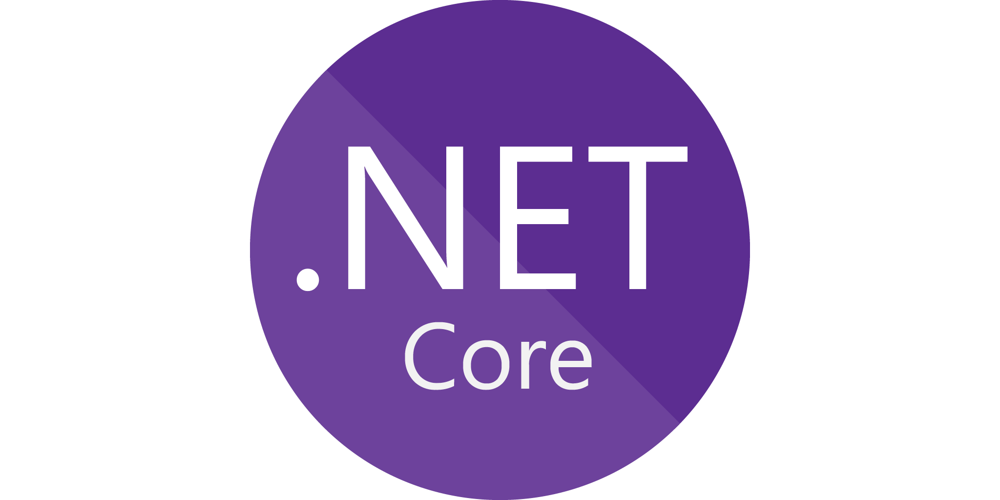
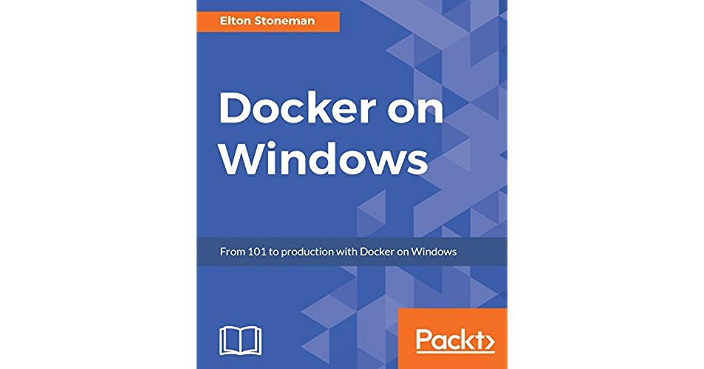
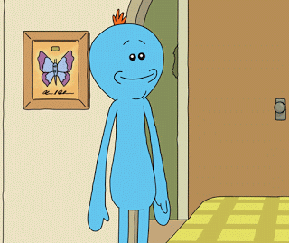
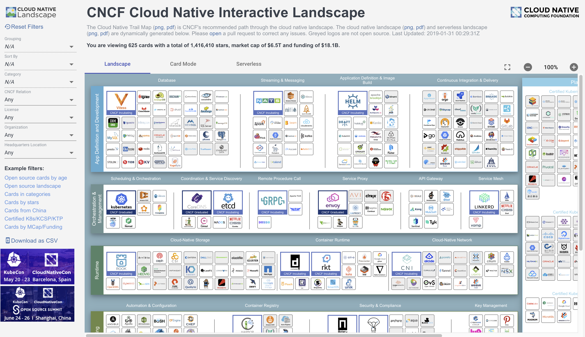
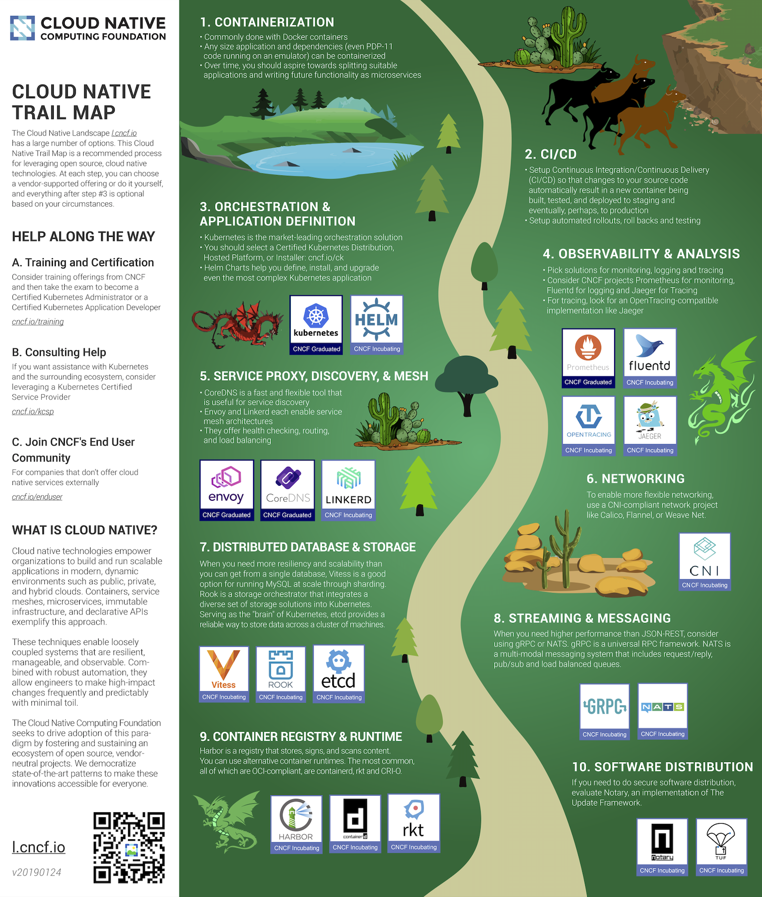
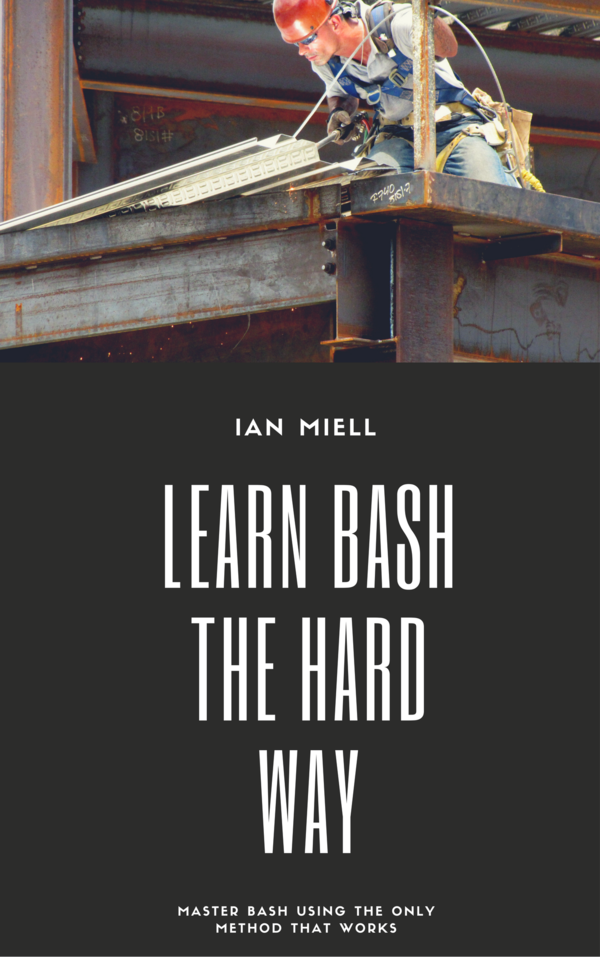
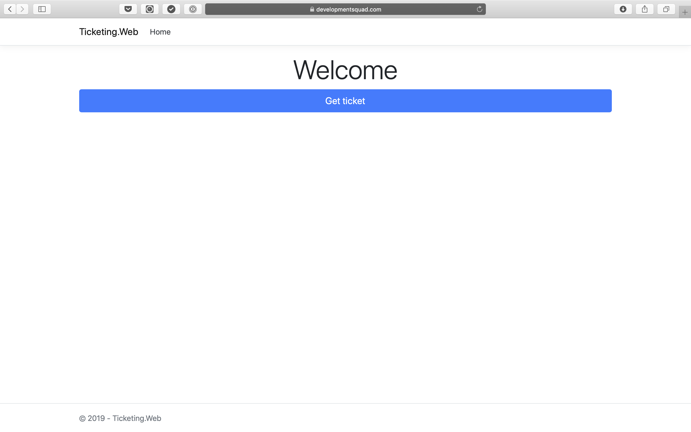
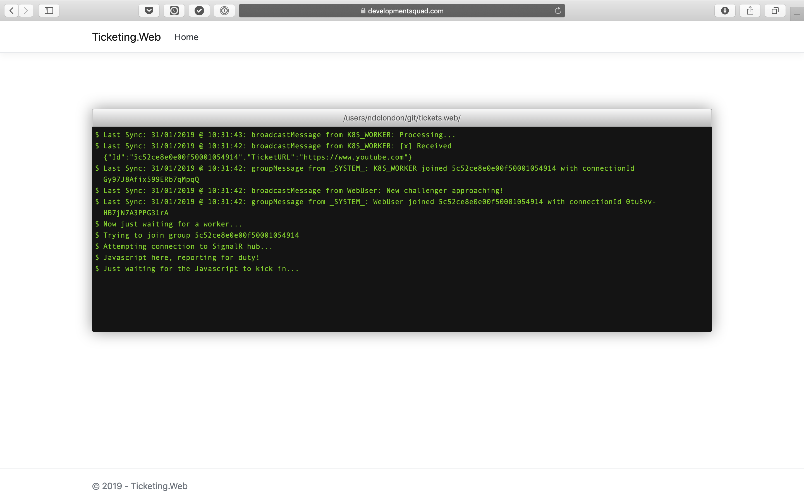
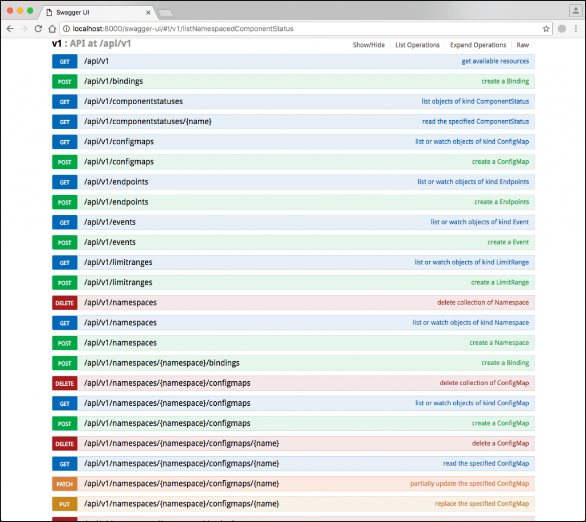
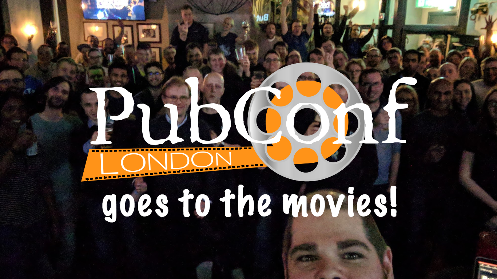

## scaling microservices with message queues, dotnet core and kubernetes
### @denhamparry

---

# Mental Health

---

# Take Photos!

---

---

---

---

# Tips

---

## Off the record tips

---

# Containers

^
This is where it all starts.
I became interested in containers because it solved.
The app works like this etc etc

---

# Well known search engine

^
Docker kept popping up for linux.
I was Windows.
I might have a Mac but I was using it as Windows in disguise.

---

# Elton Stoneman

## Docker on Windows

---

---

## Just what is a "service mesh", and if I get one will it make everything OK?

### 11:40 - 12:40: Room 5

---

---

# Microsoft ♥ Linux

---

# But I want it now!

---

# You don't have to use Kubernetes

## Sam Newman

---

# Conference bingo

---

---

---

# CNCF

---

# https://l.cncf.io

---

---

---

# Learn back

---

---

# Last Tip

---

# Learn simple things the hard way

---

# Ian Miell (@ianmiell)

## Learn Bash the hard way

---

# https://leanpub.com/learnbashthehardway

---

---

# [fit] scalability and robustness

---

---

---

## how do you deal with
# [fit] so much traffic?
## :red_car::blue_car:

---

# backend + frontend

---

---

---

---

---

---

---

---

# planning for launch :rocket:

---

---

---

---

---

---

# performance tests

---

---

---

---

---

# ready…

---

---

---

---

---

---

---

---

# too little, too late

---

---

---

---

---

---

---

---

---

# game over :skull:

---

> nice story, but we know how to do scaling.
-- Someone

---

---

---

---

---

---

---

> **the retailer reportedly** didn't have enough servers to handle the traffic surge **for the day**
-- fortune.com

---

> amazon had to manually add servers to address the issue **(and failed to add them fast enough)**
-- fortune.com

---

# what could you improve?

---

# 1. automatic scaling?

---

# 2. decoupling scaling?

---

---

---

---

---

---

# 3. decoupling failures?

---

---

---

---

---

---

---

---

---

# what if…

---

# message broker

---

---

---

---

---

---

---

---

---

---

---

---

---

---

# scale independently :white_check_mark:

---

---

---

---

# can handle failures :white_check_mark:

---

---

# [fit] what about automatic scaling?

---

---

---

# 1. open source

---

# **1. open source**
# 2. multi-cloud

---

# **1. open source**
# **2. multi-cloud**
# 3. designed to scale

---

# scale idependently
# can handle failures
# automatic scaling

---

# scale idependently :white_check_mark:
# can handle failures
# automatic scaling

---

# scale idependently :white_check_mark:
# can handle failures :white_check_mark:
# automatic scaling

---

# scale idependently :white_check_mark:
# can handle failures :white_check_mark:
# automatic scaling :white_check_mark:

---

# sounds like a plan

---

# [fit] demo

---

# the app

---

---

---

---

# [fit] containers, containers, containers

---

---

---

---

---

# deploying apps in kubernetes

---

---

---

---

---

---

---

---

# lessons learned

---

# 1. scaling in k8s

---

---

---

---

---

---

---

---

---

---

# 2. best tetris player ever

---

---

---

---

---

---

---

---

---

---

---

---

---

# 3. kubernetes == rest api

---

---

# [fit] DEMO

---

---

# questions?
