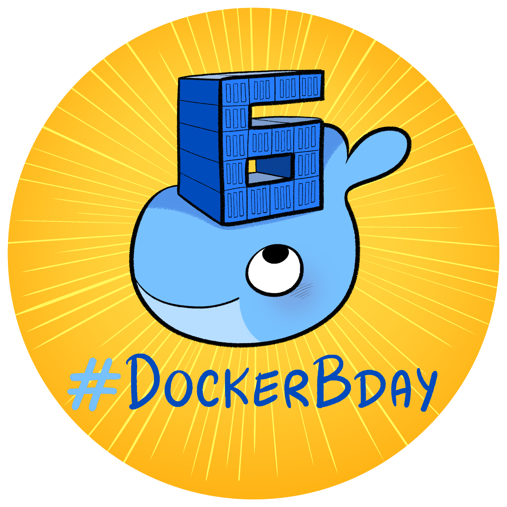
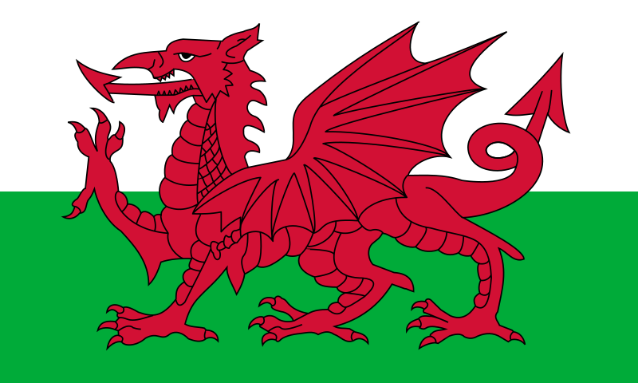
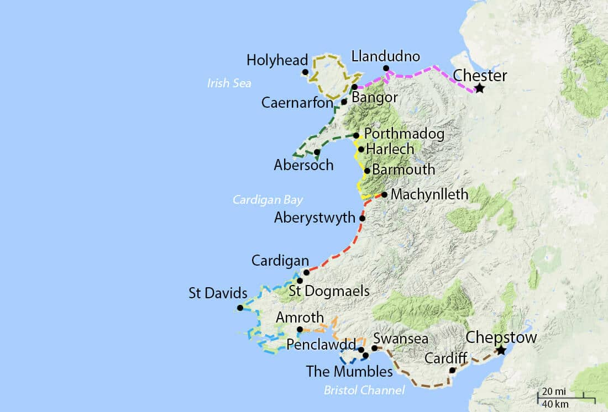
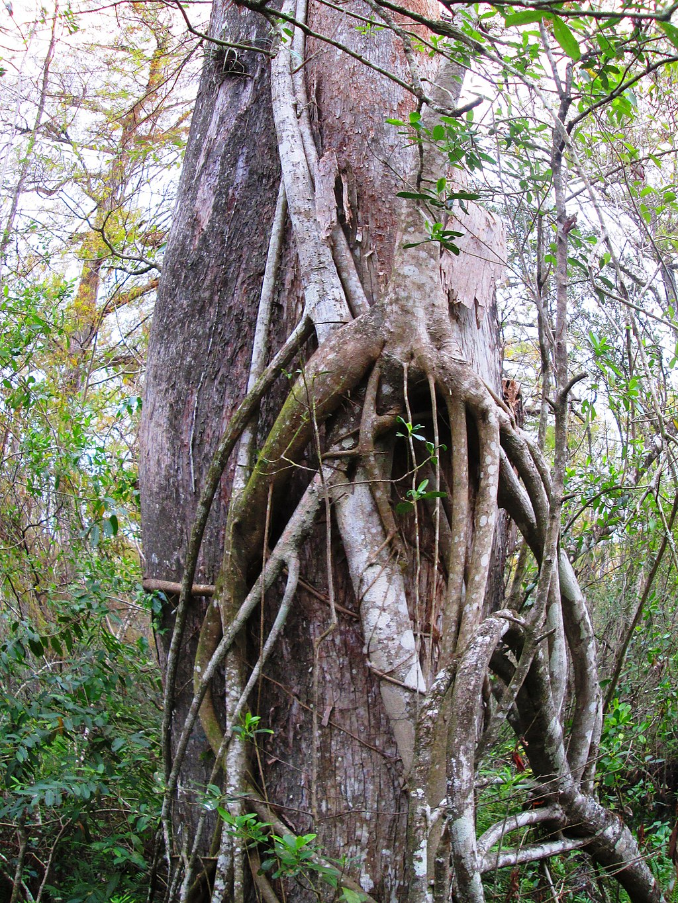
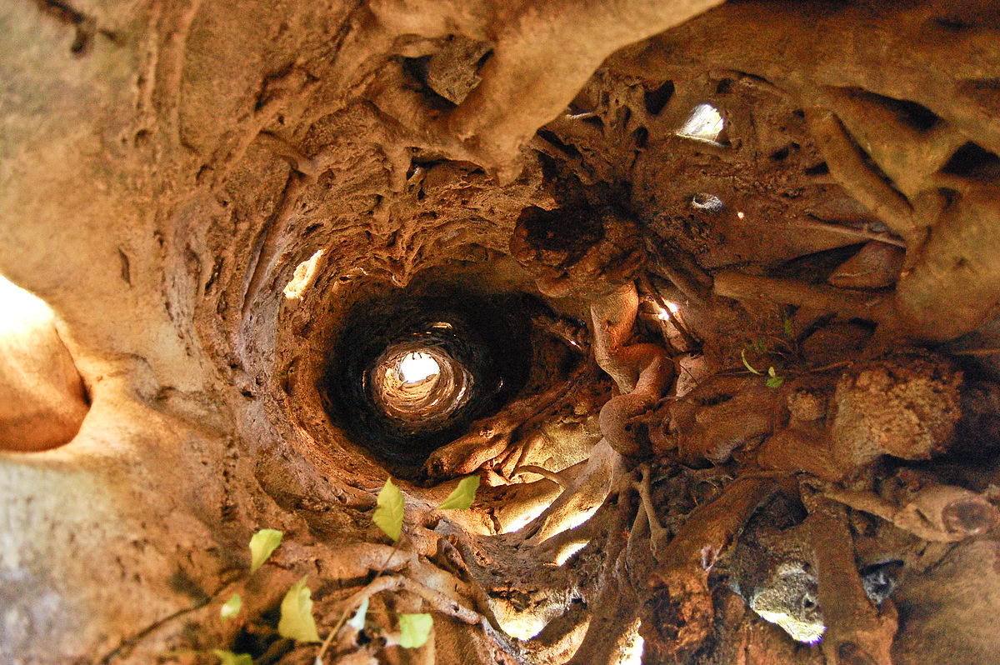
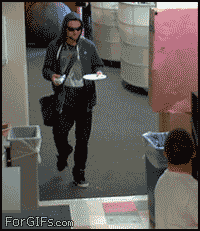
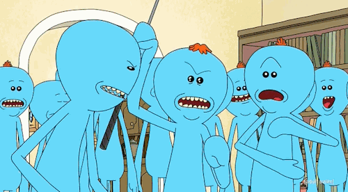
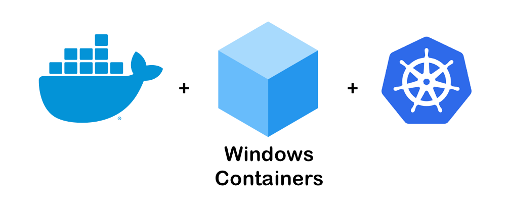
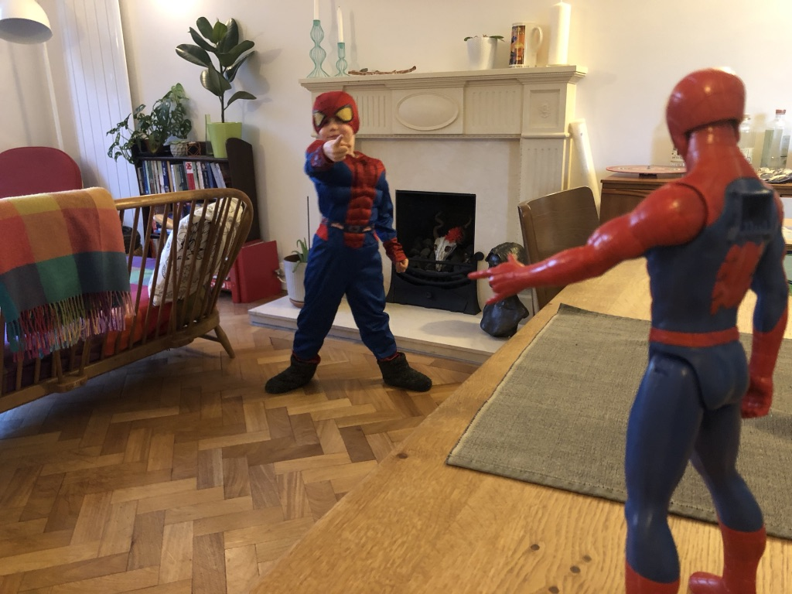
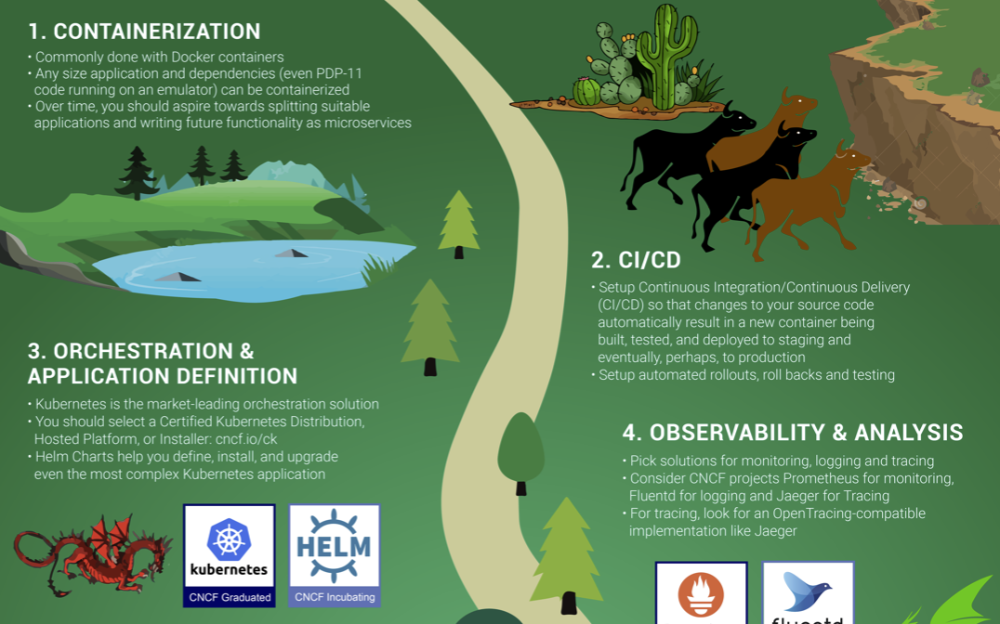

theme: Ostrich, 4

# [fit] __State__ of the __Union__ address

### _Lewis Denham-Parry_

---

# What I do

### _Co-Founder_: __Cloud Native Wales__

### _Instructor_: __LearnK8S__

### ~~_Fitter_: __Kitchens__~~

---

^
Americans think of this.
Happy Birthday Docker by the way.
How can we beat that?

---

^
We have a Dragon on our flag.
There are lots of great things that we do in Wales.
But we're also good at being used as a unit of measurement.

---

^
- As it's Dockers birthday
- If we took all the public docker hub containers as of this morning.
- A container is 1.5 meters long.

---

# _Workings_

- Docker Hub Public Images
  - __2,116,078__
- Wales Costal path
  - __1,400 km__
- Each image
  - __1.5m__
- Internet comparison
  - 1 Danny DeVeto

---

# [fit] Where you can find me

### here

### __@denhamparry__

### _lewis@denhamparry.co.uk_

---

# _About_ __you__

^
- Who is new to Docker?
- Who runs Docker on Linux?
- Who runs Docker on Windows?

---

# _About_ __me__

^
- I'm a dotnet developer.
- Started with Java in uni.
- Connected with dotnet.

---

# __10 years__ _pass_

^
- Full time / Startup / Consultant / Contacting.
- I was fed up.
- Also had a young family.
- Something had to change.

---

# __Share__

### _#Tip 1_

^
- Markdown is the best.
- Blog post of what you do.
- Answer Stack Overflow questions!
- Don't just say you fixed it FFS.

---

# [fit] __Why__ _containers_?

^
- No longer 4am coding sessions.
- Had to adapt, had to automate.
- Read about Docker somewhere.

---

# [fit] _Why_ __Docker__?

^
- Documentation.
- DotNet was well documented compared to Java.
- Examples and walk throughs helps me.

---

# [fit] __EVERYTHING__ _IS_ __LINUX__

---

# [fit] __Solve problems__

### _#Tip 2_

^
- I often forget why I got started with computers.
- It wasn't for a language or a stack.
- It wasn't for money or recognition.
- I just liked solving problems.

---

^
- This book got me started.
- Second edition out now.
- Got me up to speed on Docker.

---

# __Strangler__

# _Pattern_

^
- I was introduced to this.
- The concept of migrating a monolith into microservices.

---

Part [^1].

[^1]: Beyond My Ken [CC BY-SA 4.0 (https://creativecommons.org/licenses/by-sa/4.0)]

---

Part [^2].

[^2]: Vinayaraj [CC BY-SA 3.0 (https://creativecommons.org/licenses/by-sa/3.0)]

---

Part [^3].

[^3]: By Prashanthns - Own work, CC BY-SA 3.0, https://commons.wikimedia.org/w/index.php?curid=9567936

^
- All the business' I work with had monoliths.
- We can automate!
- We can make things better!

---

^
- Back this was back in 2017.
- The people I worked for didn't want Docker.
- No one that I knew in my bubble anyway.

---

# [fit] __Embrace change__

### _#Tip 3_

^
- Most people don't want change.
- Didn't understand containers.
- Didn't want to learn.

---

# We're all __different__

^
- The people I worked with weren't for me.
- The companies I worked for had different ideas.
- Thats fine.
- Its like any other relationship.
- We can be good people, even if we don't agree.

---

# I __had__ to _change_

^
- Moved away from Windows.
- Worked with Linux containers.

---

# __Pros__

- `docker run`
- `docker build`
- Reading _Dockerfile_s
- Learning others best practice.

---

# _Cons_

- Top down learning.
- Unknown pain points.
- So many more fails.

---

# [fit] __Prepare to fail__

### _#Tip 4_

^
- Constantly questioning myself.
- Its good when managed.
- But more often than not this is the feeling:

---

## [fit] _If you're gonna be dumb you better be tough_

---

# _But_ I am a __Developer__

^
I was looking at others code.
But I wanted to write my own code.
What do I wish I knew from day one.

---

# _Applications_

## You're __not__ going to live forever

^
- Business culture of 100% uptime.
- How did I fix this.
- Took a laptop and phone with me everywhere.

---

# [fit] __Spin up / Tear down__

### _#Tip 5_

---

^
- Usually you see pictures of containers.
- I prefer Mr Meeseeks.
- Spin up fast, do a job and die gracefully.

---

^
- But isn't Kubernetes containers running containers?

---

# _So_ what's the __point__

^
- Spoken about my past.
- Mentioned Windows a fair bit.
- There was some news this week.

---

# [fit] __Lots__ of _people_ are still starting their __journey__

^
- Kubernetes now supports Windows.
- Buzz word.
- Solves problems.
- How do people learn.

---

^
- So this feels like the same thing starting with Docker.
- No clue where to get started.
- Years of knowledge in other tools.
- Can we migrate that knowledge across?

---

# Like __cats and __dogs__ under the _same roof_

^
- So now we're treating them like pets again?
- Haven't been famous for getting on along well.
- Is this going to happen?
- Lets be optimistic.
- Will there be new things from Windows.

---

# _Back_ in my __day__

^
- These are the experiences I had.
- This is when we were trying to get Docker within our team.

---

# __Onboarding__

^
-  Windows 8.
- They had Windows Server 2012.

---

# __Confusion__

^
- Windows 10 is container ready.
- Windows Server 2016 is container ready.
- Windows Server 2019 is Kubernetes ready.

---

# __Sounds__ _tough_

^
- It will be.
- But thats why some of us got started in this industry.
- Thats why you're here tonight.

---

# __Share__

### _#Tip 1_

^
- Be proud.
- Share you problems.
- Make sure you share the solution.
- Be confident to do this, it also helps having...

---

# __Leaders__

^
I had no one for 10 years.
My first promotion circumstances.
What I wish I had.

---

# [fit] __Jessie Frazelle__

### Defining a Distinguished Engineer

### https://bit.ly/2CIrpRa

### _#Tip6_

^
This blog post sums up what I wish I had.

---

# [fit] Who _are these_ __Leaders__

^
- There are 2 following me tonight.
- People like Matt, Ben.
- Anyone else I can see in the crowd.
- Fixed my problem.

---

# [fit] _Cloud Native_ __Wales__

^
- Created it to fix the problem I had.
- Create a platform for people to speak.
- Share our stories at the pub afterwards.

---

# [fit] We _already_ have __amazing leaders__

^
Anouska - Head of Engineering and keynote speaker.
Dan - Blue Green deployments and hes colour blind.
Nat Netflix - Pembrokeshire.
James - Jenkins X.
Human Genome project in Brecon.

---

# [fit] _We're_ all __different__

^
- We work on different:
- platforms.
- languages. 
- frameworks.

---

# [fit] _What_ brings us __together__

^
Containers.

---

# https://l.cncf.io

---

# [fit] _So_ where _are we_ __going__

^
- Containers running side by side in production.
- Technically yes.
- Reality?

---

# __Changes__

^
- Something was supposed to happen tomorrow.
- I was going to say this creates changes.
- Ironically the date has changed.

---

# _History_ __repeating__

^
- Seeing companies leave.
- People getting made redundant.

---

# __Community__

^
I sleep at night now though.
I feel like I have a community who supports me.

---