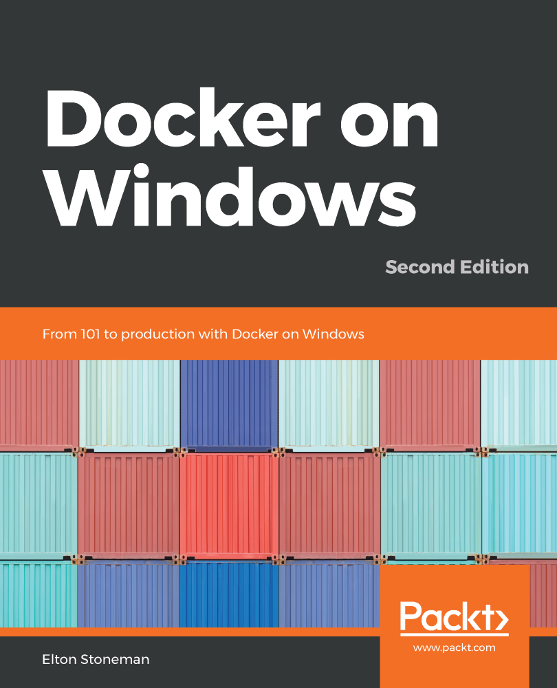

# [fit] __State__ of the __Nation__

## _Lewis Denham-Parry_

---

# What I do

### _Co-Founder_: __Cloud Native Wales__

### _Instructor_: __LearnK8S__
cd 
### _Fitter_: __Kitchens__

---

# [fit] Where you can find me

## __@denhamparry__

---

# About __you__

^
- Who is new to Docker?
- Who runs Docker on Linux?
- Who runs Docker on Windows?

---

# About __me__

^
- I'm a dotnet developer.
- Started with Java in uni.
- Connected with dotnet.

---

# 10 years pass

^
- Full time / Startup / Consultant / Contacting.
- I was fed up.
- Also had a young family.
- Something had to change.

---

# [fit] Share

## Tip 1

- Markdown is the best.
- Blog post of what you do.
- Answer Stack Overflow questions!
- Don't just say you fixed it FFS.

---

# [fit] Why containers?

^
- No longer 4am coding sessions.
- Had to adapt, had to automate.
- Read about Docker somewhere.

---

# [fit] Why Docker?

^
- Documentation.
- DotNet was well documented compared to Java.
- Examples and walk throughs help me.

---

# [fit] EVERYTHING IS LINUX

---

# [fit] Solve problems

## Tip 1

^
- I often forget why I got started with computers.
- It wasn't for a language or a stack.
- It wasn't for money or being on hacker news.
- I just liked solving problems.

---

^
- This book got me started.
- Second edition out now.
- Got me up to speed on Docker.

---

# Stangler pattern

^
- I was introduced to this.
- The concept of migrating a monolith into microservices.
- All the business' I work with had monoliths.
- We can automate!
- We can make things better!

---

^
- Back this was back in 2017.
- The people I worked for didn't want Docker.
- No one that I knew in my bubble anyway.

---

# [fit] Embrace change

## Tip 2

^
- No one wanted change.
- Didn't understand containers.
- Didn't want to learn.

---