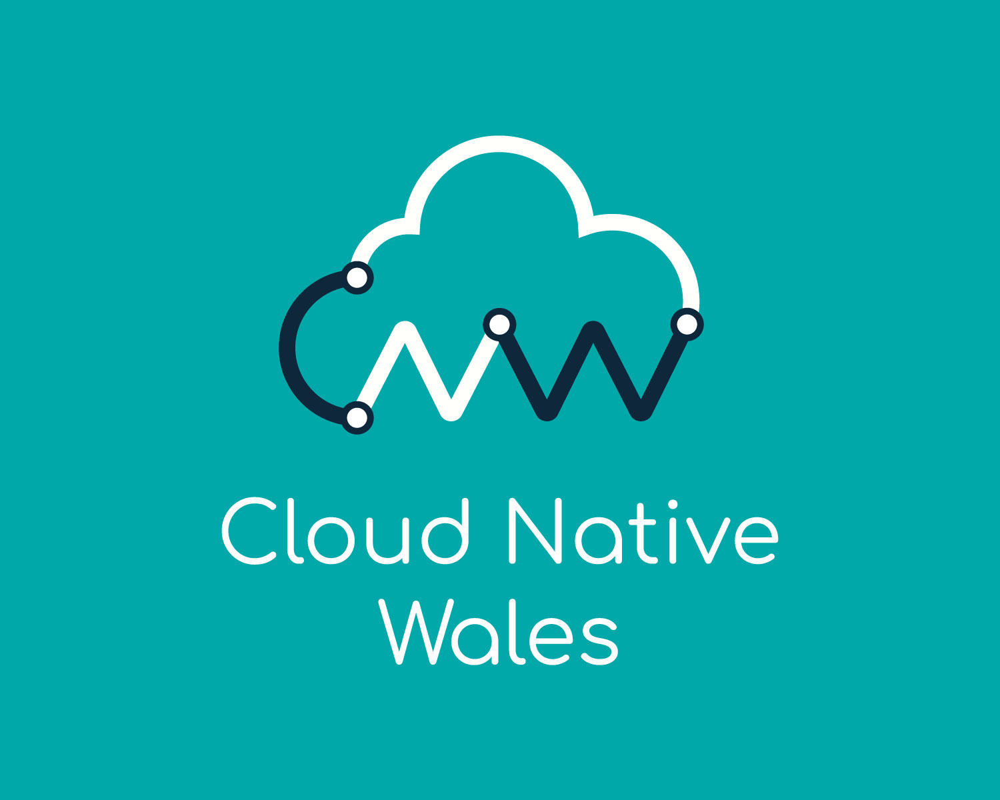
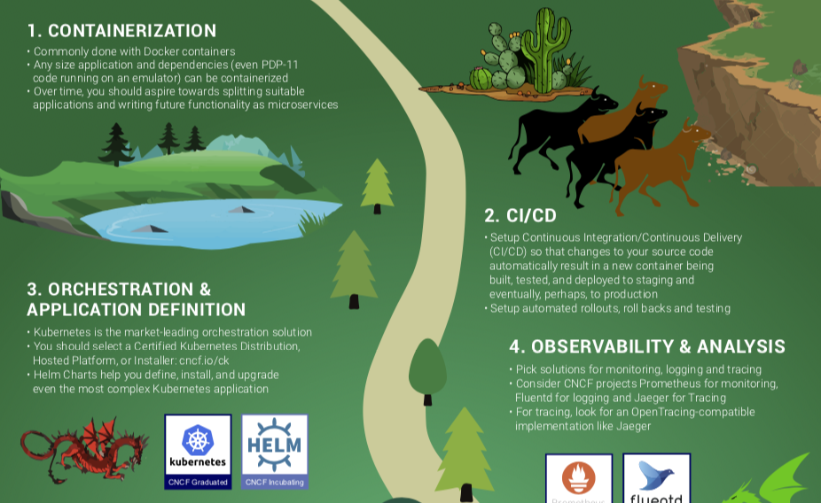
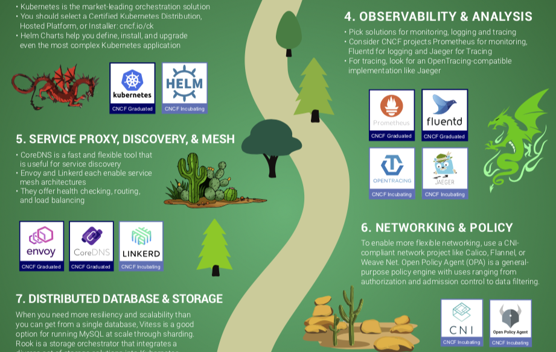
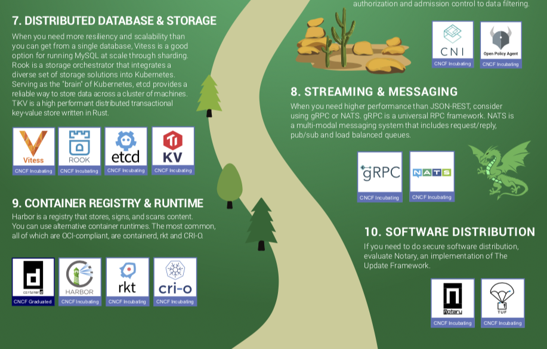

# How do we become Cloud Native

## **Lewis Denham-Parry**

---

## Take **Photos**

^
Feel free

---

# [fit] **About** me

---

---

---

## **Mental Health**

# [fit] bit.ly/2K8HeoV

^
I've suffered
Find professional advice
OSMI Guideline for mental wellness at conferences handbook

---

## **Climate Change**

# [fit] bit.ly/2WopFYw

^
Global emissions 3% data centres.
Paul Johnston and Anne Currie.

---

# [fit] **Agenda**

* CNCF
* Trail Map
* Conclusion
* Questions

---

# [fit] Follow the **yellow** brick road

---

# [fit] Follow the **CNCF** road

---

# [fit] What is the **CNCF**?

---

---

* Open source software foundation
* Host and nurture components of cloud native software stacks
* Members including the Worlds largest public cloud and enterprise software companies as well as dozens of innovative startups.

---

# [fit] Follow the **CNCF** road

---

# [fit] Follow the **CNCF Trail Map**

---

# [fit] https://**l**.cncf.io

---

# [fit] https://**landscape**.cncf.io

---

---

# Trail map

* Map through the previously uncharted terrain of cloud native technologies.
* There are many routes to deploying a cloud native application.
* CNCF Projects represent a particularly well-travelled path.

---

# Plan of action

* Go through each step.
* Discuss the concept.

---

# Break **it** down

---

---

# **1.** Containers

^
Who uses containers

---

# [fit] What do they **replace**

^
Physical boxes and VMs.
We still use them.
More efficiently.

---

## [fit] Control Groups + Namespaces

# [fit] = **Docker**

^
How can we be more efficient.
Manage applications alongside each other.

---

# Focus on **containers**

^
Get the best results from well structured containers.

---

# **2.** CI/CD

---

# [fit] **Avoid**
## [fit] works on my machine

^
Think of it as becoming your own dependency.
Do you want to wake up at 2am?

---

# [fit] Build **dependencies**

^
These should be contained as much as possible.

---

# [fit] **Multi-stage** builds

^
Build dependencies can be in base image.
Helps create smaller images.
Reduce attack surface within containers.

---

# [fit] **Automate**
# [fit] everything

^
Empower people to make changes.
If you make 10's, 100's or 1000's of changes a day they become trivial.
Remember fortnightly releases.

---

# [fit] **3.** Orchestrations and Application definition

---

# Kubernetes

^
There are other options available.
Mesos and Nomad name a few.
Kubernetes won the war.

---

## [fit] Q. What manages containers
# [fit] A. **Containers**

^
Its just containers running containers.

---

# [fit] **NODES**
## [fit] master
## [fit] worker

^
Master nodes manage the cluster.
Its just an API.
Workers run containers.
You can scale your nodes.

---

# [fit] What are we **working** with

^
What's in the box

---

## [fit] **Pods**
## [fit] Deployments
## [fit] Services
## [fit] Ingresses

^
One or more containers.

---

## [fit] Pods
## [fit] **Deployments**
## [fit] Services
## [fit] Ingresses

^
Manages your pods.

---

## [fit] Pods
## [fit] Deployments
## [fit] **Services**
## [fit] Ingresses

^
Internal load balancer for pods.

---

## [fit] Pods
## [fit] Deployments
## [fit] Services
## [fit] **Ingresses**

^
External traffic load balancer for services.

---

# YAML

^
Used to create these.

---

# [fit] Want to know more

---

## [fit] 13:30 (Room 3)
# [fit] **Three Years of Lessons from Running Potentially Malicious Code Inside Container**
## [fit] Ben Hall

---

## [fit] Tomorrow 14:30 (Room 2)
# [fit] **Workshop: Show me the Kubernetes**
## [fit] Salman Iqbal and Lewis Denham-Parry

---

# [fit] Helm

^
What is helm

---

# [fit] **Share** applications

^
We listed some kubernetes fundamentals.

---

# [fit] Share **Helm charts**

^
Helm uses charts to share applications

---

# [fit] What's the **tiller**

^
Tiller used to write the Yaml and apply it to Kubernetes.
Required lots of access.
Security vulnerability.

---

# Security

^
Kubernetes is product first security second.
How do you manage security?

---

## [fit] 17:15 (Keynote)
# [fit] **Microservices & containers: getting your security team on board**
## [fit] Liz Rice

^
I follow the leaders.
Liz is one of them.
Works for aqua.

---

# [fit] **Congratulations**

^
These first 3 steps are the min to be cloud native.

---

# [fit] **What's** next

^
We have more steps

---

^
Lets look at why we'd want to continue our journey.

---

# **4.** Observability and Analysis

^
What's going on.

---

# [fit]  What's **happening** now

^
Wait, I'm Welsh...

---

# [fit]  What's **occurring**

^
This is good to know.
Dashboards are nice.
But what happens when something goes wrong.

---

# [fit] What has **occurred**

^
This is arguably more important.
Think of debugging your code via steps.
We shouldn't care where our application runs.
Should be able to step through the logs.

---

# [fit] But what about the **data**

^
Spoke about nodes and containers.
We can scrape information about them.
Can also create custom endpoints to scrape.

---

# **5.** Service Proxy, Discovery and Mesh

---

# Scalability

^
What this really means

---

# [fit] **Where** is it

^
We don't really care where it is.
But need to know where to send traffic to.

---

# [fit] **Sidecar proxy**
# [fit] Service discovery
# [fit] Load balancing
# [fit] Authentication and authorization
# [fit] Encryption

^
A sidecar proxy runs alongside a pod.
Route/proxy traffic to and from the container it runs alongside
Communicates with other sidecar proxies.
Managed by the orchestration framework.
Many service mesh implementations intercept and manage all ingress and egress traffic to the pod.

---
# [fit] Sidecar proxy
# [fit] **Service discovery**
# [fit] Load balancing
# [fit] Authentication and authorization
# [fit] Encryption

^
Find/discover a healthy, available instance of the other service.
Typically performs a DNS lookup for this purpose.

---

# [fit] Sidecar proxy
# [fit] Service discovery
# [fit] **Load balancing**
# [fit] Authentication and authorization
# [fit] Encryption

^
Most orchestration frameworks already provide Layer 4 (transport layer) load balancing.
A service mesh implements more sophisticated Layer 7 (application layer) load balancing.
Richer algorithms and more powerful traffic management.
Load‑balancing parameters can be modified via API.
Possible to orchestrate blue‑green or canary deployments.

---

# [fit] Sidecar proxy
# [fit] Service discovery
# [fit] Load balancing
# [fit] **Authentication and authorization**
# [fit] Encryption

^
Can authorize and authenticate requests made from both outside and within the app.
Sends only validated requests to instances.

---

# [fit] Sidecar proxy
# [fit] Service discovery
# [fit] Load balancing
# [fit] Authentication and authorization
# [fit] **Encryption**

^
Can encrypt and decrypt requests and responses.
Improve performance by prioritizing the reuse of existing connections.
Most common implementation for encrypting traffic is mutual TLS (mTLS).
A public key infrastructure (PKI) generates and distributes certificates and keys for use by the sidecar proxies.

---

# **6.** Network and Policy

---

# [fit] Container Network Interface **(CNI)**

^
A common interface between the network plugins and container execution.
Designed to be a minimal specification.
Concerned only with the network connectivity of containers and removing allocated resources when the container is deleted.

---

# [fit] Open Policy Agent **(OPA)**

^
OPA is a lightweight general-purpose policy engine that can be co-located with your service.
You can integrate OPA as a sidecar, host-level daemon, or library.

---

# [fit] Open Policy Agent **(OPA)**

^
A policy is a set of rules that governs the behaviour of a service.
Policy enablement empowers users to read, write, and manage these rules without needing specialized development or operational expertise.
When your users can implement policies without recompiling your source code, then your service is policy enabled.

---

# [fit] Open Policy Agent **(OPA)**

^
Services offload policy decisions to OPA by executing queries.
OPA evaluates policies and data to produce query results (which are sent back to the client).
Policies are written in a high-level declarative language and can be loaded into OPA via the filesystem or well-defined APIs.

---

---

# **7.** Distributed data and storage

^
Problems with storage.
Containers stop and lose state.
Number of solutions.

---

# [fit] Sharding

^
Sharding your database involves breaking up your big database into many, much smaller databases that share nothing and can be spread across multiple servers. 
These small databases are fast, easy to manage, and often are much cheaper to use as they are often implemented by using open source licensed databases.

---

# [fit] Sharding

^
There’s a variety of different approaches, but essentially, it’s just a matter of taking a look at your database and essentially ‘horizontally partitioning’ your data into logically related rows

---

# [fit] Sharding

^
The logical rows that you come up with get isolated and deployed into their own database, and as a result, data interaction becomes much faster and more responsive.

---

# [fit] Sharding

^
Given, this is a very simple look at sharding, but it’s something that modern enterprise applications that are looking at leveraging the benefits of cloud computing without encountering significance performance problems with their database I/O when their middleware applications reach economies of scale.

---

# [fit] Node **Storage**

^
Data can be stored on the node.
What happens when containers move to another node.

---

# [fit] **Key value** pairs

^
Out the box Kubernetes uses etcd.
Use Raft protocol.

---

# **8.** Streaming and messaging

^
Alternatives to REST

---

# g**RPC**

^
Remote procedure call
Low latency, highly scalable, distributed systems.
Designing a new protocol that needs to be accurate, efficient and language independent.

---

# [fit] Is it **better**

^
gRPC largely follows HTTP semantics over HTTP/2
Allow for full-duplex streaming.

---

# [fit] Is it **better**

^
Diverge from typical REST conventions as we use static paths for performance reasons during call dispatch
Parsing call parameters from paths, query parameters and payload body adds latency and complexity.

---

# [fit] **NATS**

^
A simple, high performance open source messaging system.
The core NATS Server acts as a central nervous system for building distributed applications.

---

# [fit] pub / **sub**

NATS is an open source, lightweight, high-performance cloud native infrastructure messaging system.
It implements a highly scalable and elegant publish-subscribe (pub/sub) distribution model.

---

# **9.** Container registry and runtime

^
When we started talking about containers I mentioned Docker.

---

# [fit] Container **Registry**

^
Why not just use Docker hub.
Dependencies.
Security.

---

# [fit] What's **in** your containers

^
Containers are built on other images.
What if there's an issue with an image.
Can we scan the images that are being used.

---

# [fit] **Runtimes**

^
There's more than just Docker.
Different options have different features.
Security for example.  GVisor.

---

# **10.** Software distribution

^
How do we know what we're running is what we built.

---

## [fit] **Case study**
# [fit] Chicago Tylenol Murders

^
1982
Laced with potassium cyanide.
Seven confirmed deaths.
Factory > Distribution.
Plastic seal

---

# How do we do this with **containers**

^
Digitally sign them.

---

# But why

---

# Empower people with tools

^
Should you have to learn all of this?
Problems of growth.
What about onboarding new people.

---

# None of this should be your **USP**

^
Unique selling point.
You shouldn't use something for using this technology.
I use Monzo - Matt Heath.

---

## 15:30 (Room 3)
# **Breaking Down Problems**
## Matt Heath

---

# [fit] This **could** be your **UHP***

^
Think I made this up.

---

# [fit] Unique **hiring** policy

^
Making peoples lives easier.
Focusing on shipping code.
This isn't a new technology.
It's a new mindset.

---

# Shift **left**

^
Pick up problems as quickly as possible.
How can we do this.

---

## [fit] 11:45 (Room 2)
# [fit] **Creating an Effective Developer Experience for Cloud-Native Apps**
## [fit] Daniel Bryant

---

# **Change**

^
Change isn't easy.
What I had wasn't working for me.
This is.
So back to the start.

---

# [fit] The state of data centre energy use

## [fit] **Whitepaper**

# [fit] bit.ly/2I67oWD

^
Here's a whitepaper.

---

# [fit] sustainable servers by 2024

## [fit] **Petition**

# [fit] bit.ly/2wrS1CE

^
Here's the petition.

---

# [fit] Thank you

## [fit] **@denhamparry**

# [fit] questions