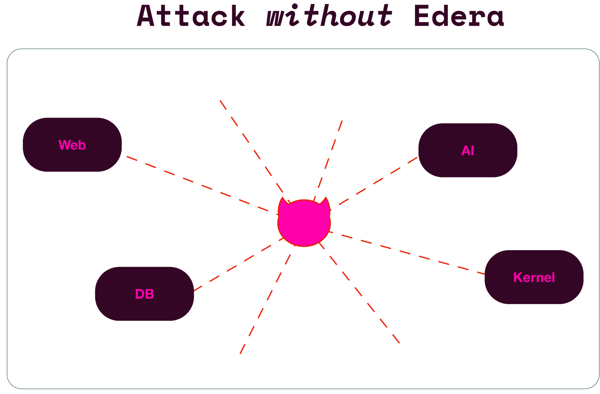
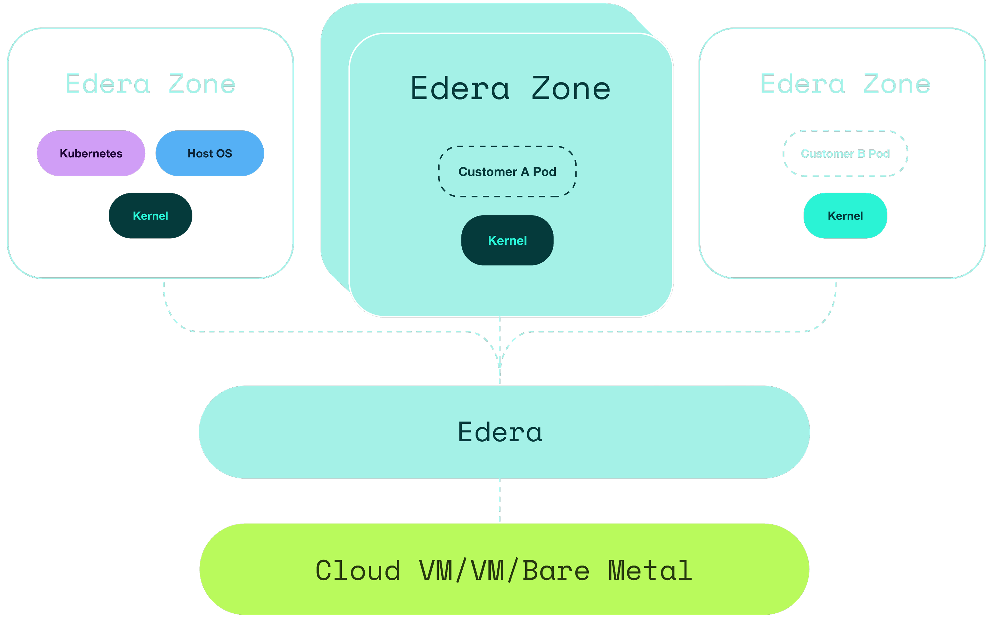
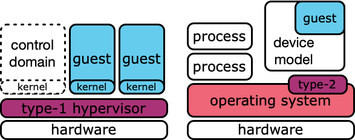
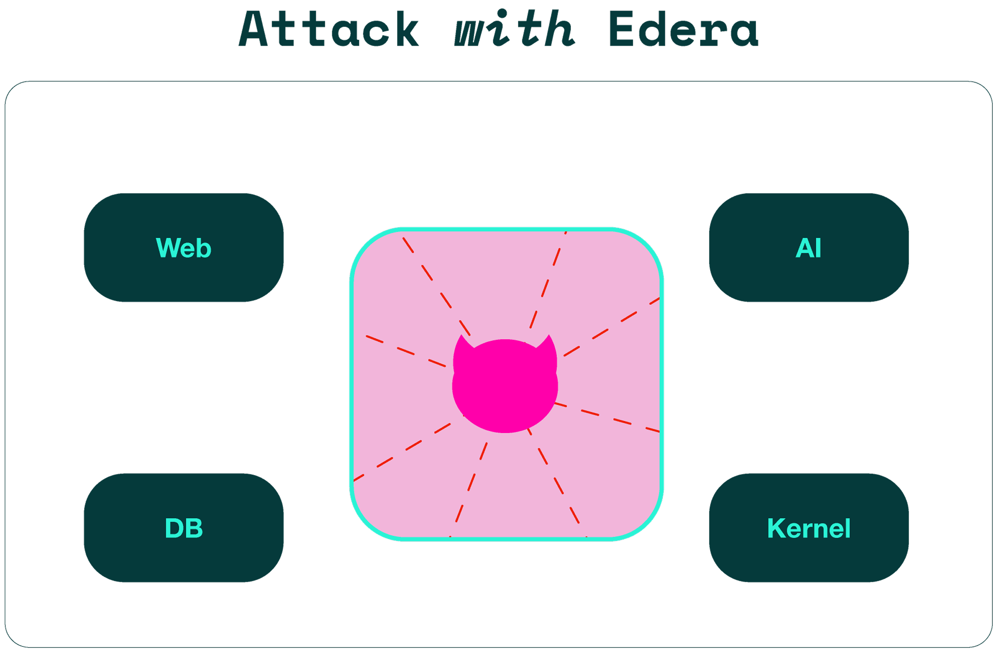
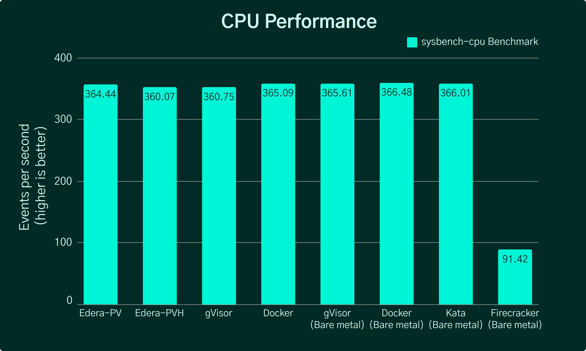

<!-- _class: title -->

# The Road to Multitenancy

## Running Secure Multi-Tenant Workloads at Scale

Lewis Denham-Parry | [Edera.dev](https://edera.dev)
[London Platform User Group (LoPUG)](https://www.meetup.com/london-platform-user-group-lopug/events/311100198) | January 14th, 2026

<!--
Speaker Notes:
- Welcome everyone to "The Road to Multitenancy"
- Introduce yourself: Lewis Denham-Parry from Edera
- Set context: Platform engineering challenges in multi-tenant environments
- Preview: We'll explore the trade-offs and introduce a better solution
- Estimated time: 20-30 minutes with Q&A
- Encourage questions throughout or save for end
-->

---

<!-- _class: content -->

# The Multi-Tenancy Problem

**Challenge:** How do we run multiple untrusted workloads on shared infrastructure?

- **Security Isolation**: Each tenant's workload must be isolated from others
- **Performance**: Isolation shouldn't degrade application performance
- **Scale**: Must work with orchestrators like Kubernetes
- **Cost**: Shared resources reduce infrastructure costs

**The Dilemma**: Security vs Performance vs Scale

<!--
Speaker Notes:
- Multi-tenancy: running multiple customers/teams on shared infrastructure
- Core challenge: untrusted workloads (you don't control what they run)
- Security: tenant A shouldn't access or affect tenant B
- Performance: isolation mechanisms often add overhead
- Scale: Kubernetes promises density, but security limits it
- Cost: shared resources save money vs dedicated infrastructure
- The trilemma: traditionally you pick 2 of 3 (security, performance, scale)
- Platform engineers face this daily - it's not theoretical
-->

---

<!-- _class: content -->

# Scale vs Isolation: The Orchestrator Dilemma

**Kubernetes Promise:** Run many workloads on shared infrastructure

**Reality Check:**
- Orchestrators like Kubernetes were built for scale
- Multiple workloads share the same worker nodes
- Shared kernel = shared attack surface
- One compromised container can impact others

**The Contradiction:**
> Separate machines for isolation defeats the purpose of orchestration

<!--
Speaker Notes:
- Kubernetes was designed for bin-packing workloads onto nodes
- Core value: efficient resource utilization through sharing
- But sharing creates security concerns in multi-tenant scenarios
- All containers on a node share the Linux kernel
- Kernel vulnerability = all tenants on that node at risk
- Container escape: break out and access host or other containers
- Next slide shows visual of the attack surface
- The fundamental contradiction: isolation vs density
- Using separate machines for each tenant? That's pre-Kubernetes thinking
- We need a better solution that preserves both goals
-->

---

<!-- _class: content -->

# Shared Kernel Attack Surface

<!--
Speaker Notes:
- Visual shows the shared kernel attack surface
- Point out: one compromised container can escape to host or other containers
- This diagram illustrates the fundamental security problem
- All containers sharing one kernel = all tenants at risk
-->

---

<!-- _class: content -->

# Current Approach #1: Separate Machines

**Solution:** Dedicated machines per tenant

**Pros:**
- ✅ Strong isolation guarantee
- ✅ Simple security model
- ✅ No shared kernel concerns

**Cons:**
- ❌ Defeats orchestration purpose
- ❌ Poor resource utilization and high infrastructure costs
- ❌ Complex cluster management
- ❌ Doesn't scale economically

<!--
Speaker Notes:
- Most conservative approach: one tenant per machine/cluster
- Security is straightforward: physical/VM isolation
- No shared kernel = no kernel attack surface between tenants
- BUT: this is expensive and wasteful
- Example: 100 tenants = 100 machines, even if most are idle
- Resource utilization typically 20-30% (wasted capacity)
- Operational complexity: managing 100 clusters vs 1
- Infrastructure costs scale linearly with tenant count
- This approach works, but it's economically unsustainable
- Defeats the whole point of using Kubernetes for efficiency
-->

---

<!-- _class: content -->

# Current Approach #2: Shared Kernel

**Solution:** Standard container runtimes (containerd, CRI-O)

**Security Concerns:**
- Shared kernel = shared vulnerabilities
- Container escapes can access host
- Kernel exploits affect all tenants
- Privilege escalation and runtime attacks

**Verdict:** Not suitable for untrusted multi-tenant workloads

<!--
Speaker Notes:
- Default Kubernetes setup: containerd or CRI-O runtime
- All containers share the Linux kernel on the host
- Container = process isolation using namespaces and cgroups
- But namespaces weren't designed for security boundaries
- One kernel vulnerability can compromise all containers
- Historical examples: Dirty COW, RunC escapes, kernel exploits
- Container escape: break out of namespace and access host
- Privilege escalation: gain root on host from container
- Resource exhaustion: one tenant starves others (noisy neighbor)
- Fine for trusted workloads (your own apps)
- NOT acceptable for untrusted multi-tenant scenarios
- Compliance and security teams rightfully reject this
-->

---

<!-- _class: content -->

# Current Approach #3: Kata Containers

**Solution:** Lightweight VMs for container isolation (separate kernel per container)

**Pros:**
- ✅ Strong isolation via hardware virtualization
- ✅ Compatible with Kubernetes

**Cons:**
- ❌ VM startup overhead (150-300ms with modern configurations, up to 1-2s with older setups)
- ❌ Higher memory footprint per container
- ❌ Additional infrastructure complexity

<!--
Speaker Notes:
- Kata Containers: lightweight VMs that look like containers
- Each container gets its own VM with its own kernel
- Uses hardware virtualization (KVM, Firecracker, Cloud Hypervisor)
- Strong isolation: kernel vulnerability in one VM doesn't affect others
- Kubernetes compatible: implements CRI, drop-in replacement
- Security win: finally proper isolation for multi-tenancy
- BUT: performance trade-offs
- VM startup overhead: 150-300ms with modern configurations (optimized setups), up to 1-2s with older configurations (vs milliseconds for containers)
- Next slide shows startup time comparison benchmark
- Memory: each VM reserves memory for kernel (~100MB overhead)
- High-churn workloads (serverless, batch jobs) suffer most
- Infrastructure: need nested virtualization in cloud, specific host setup
- Good solution, but sacrifices the speed and density we want
- Performance has improved significantly with recent optimizations
-->

---

<!-- _class: content -->

# Kata Containers: Startup Time Overhead

<!--
Speaker Notes:
- Diagram shows startup time comparison - visual evidence of VM overhead
- Kata takes ~750ms vs Edera's optimized approach
- This overhead impacts serverless and batch workloads significantly
- Notice the 2.5x difference in cold start times
-->

---

<!-- _class: content -->

# Current Approach #4: gVisor

**Solution:** Userspace kernel that intercepts syscalls for isolation

**Pros:**
- ✅ Improved isolation vs standard containers
- ✅ Smaller footprint than VMs

**Cons:**
- ❌ Performance penalty from syscall interception (varies by workload)
- ❌ Limited syscall support and compatibility issues
- ❌ Added debugging complexity

<!--
Speaker Notes:
- gVisor (Google's contribution): userspace kernel approach
- Every system call goes through gVisor's "Sentry" process
- Implements subset of Linux kernel in Go (in userspace)
- Reduces attack surface: app never directly accesses host kernel
- Better than shared kernel, but not as strong as VMs
- Smaller footprint than Kata: no full VM overhead
- BUT: performance tax on system calls
- Syscall interception adds latency (microseconds per call)
- Next slide shows the syscall overhead benchmark
- Performance varies widely: <1% overhead for CPU-bound workloads, 10-30%+ for I/O-heavy applications
- At Ant Group production: 70% of apps have <1% overhead, 25% have <3% overhead [Source: gVisor.dev - Running gVisor in Production at Scale in Ant, Dec 2021]
- Compatibility: doesn't support all syscalls (some apps won't run)
- Debugging: syscall stack traces become complex
- Used by Google Cloud Run and some serverless platforms
- Trade-off: better than nothing, but still costs performance for syscall-heavy workloads
-->

---

<!-- _class: content -->

# gVisor: Syscall Performance Impact

<!--
Speaker Notes:
- Diagram shows the syscall overhead impact - visual evidence of performance penalty
- Notice the latency increase for I/O-heavy workloads
- This is the trade-off: security through syscall interception costs performance
- For CPU-bound apps, impact is minimal; for I/O-heavy apps, it's significant
-->

---

<!-- _class: content -->

# Current Approach #5: Firecracker

**Solution:** Lightweight microVMs for serverless and container workloads

**Pros:**
- ✅ Strong isolation via hardware virtualization (KVM)
- ✅ Fast startup times (~125ms vs 1-2s for Kata)
- ✅ Minimal memory footprint (~5MB per microVM)

**Cons:**
- ❌ Still VM overhead (vs pure containers)
- ❌ Limited to Linux guests
- ❌ Requires nested virtualization in cloud environments
- ❌ Specialized use case (designed for serverless)

<!--
Speaker Notes:
- Firecracker: AWS's answer to lightweight isolation
- Powers AWS Lambda - production-proven at massive scale (trillions of requests/month)
- Note: Fargate's use of Firecracker is disputed by some sources, so we focus on Lambda where it's confirmed
- MicroVMs: stripped-down VMs with minimal device emulation
- Fast startup: ~125ms vs older Kata (significant improvement)
- Next slide shows benchmark comparison of startup times
- Memory: ~5MB overhead vs ~100MB for traditional VMs
- KVM virtualization: hardware-level isolation guarantee
- BUT: still has VM layer, just optimized
- Limited to Linux guests: no Windows support
- Nested virtualization: need specific host configuration in cloud
- Purpose-built for serverless: not general-purpose container runtime
- Trade-off: better than traditional VMs for startup time, but still not container-native
- Good for Function-as-a-Service, less ideal for long-running workloads
-->

---

<!-- _class: content -->

# Firecracker: MicroVM Startup Performance

<!--
Speaker Notes:
- Diagram shows benchmark comparison of startup times across different approaches
- Firecracker achieves ~125ms cold starts - significantly faster than traditional VMs
- Still slower than pure containers, but with hardware isolation guarantees
- This is the trade-off for serverless workloads: speed vs security
-->

---

<!-- _class: content -->

# Current Approach #6: Bare Metal

**Solution:** Dedicated physical servers per tenant

**Pros:**
- ✅ Maximum isolation (physical separation)
- ✅ Predictable performance (no noisy neighbors)
- ✅ Full hardware control and resource access
- ✅ No virtualization overhead

**Cons:**
- ❌ Extremely poor resource utilization
- ❌ Highest infrastructure costs (dedicated hardware)
- ❌ Slow provisioning (minutes to hours vs seconds)
- ❌ Does not scale with tenant growth

<!--
Speaker Notes:
- Bare metal: the ultimate isolation approach - separate physical servers
- Maximum isolation: physical network boundaries, no shared CPU/memory/kernel
- Predictable performance: no virtualization overhead, no noisy neighbors
- Full hardware access: GPUs, specialized hardware, direct I/O
- No hypervisor tax: applications run at native hardware speed
- BUT: this is the most expensive and least scalable option
- Resource utilization: typical 10-30% (70-90% wasted capacity)
- Infrastructure costs: $100-$500/month per server, multiplied by tenant count
- Provisioning time: minutes to hours vs seconds for containers
- Scaling: adding 100 tenants = buying 100 servers
- This approach only makes sense for specialized workloads:
  - High-security government/financial workloads
  - GPU-intensive ML training with dedicated hardware
  - Compliance requirements mandating physical separation
- For most multi-tenant platforms, bare metal defeats the purpose
- Including this to show the full spectrum of isolation options
-->

---

<!-- _class: content -->

# Comparison Matrix: Security vs Performance

| Approach | Security Isolation | Performance | Scale | Complexity |
|----------|-------------------|-------------|-------|------------|
| **Separate Machines** | ⭐⭐⭐⭐⭐ | ⭐⭐⭐⭐⭐ | ⭐ | ⭐⭐ |
| **Shared Kernel** | ⭐ | ⭐⭐⭐⭐⭐ | ⭐⭐⭐⭐⭐ | ⭐⭐⭐⭐⭐ |
| **Kata Containers** | ⭐⭐⭐⭐ | ⭐⭐⭐ | ⭐⭐⭐⭐ | ⭐⭐⭐ |
| **gVisor** | ⭐⭐⭐ | ⭐⭐⭐ | ⭐⭐⭐⭐ | ⭐⭐⭐ |
| **Firecracker** | ⭐⭐⭐⭐ | ⭐⭐⭐⭐ | ⭐⭐⭐ | ⭐⭐⭐ |
| **Bare Metal** | ⭐⭐⭐⭐⭐ | ⭐⭐⭐⭐⭐ | ⭐ | ⭐ |
| **Edera** | ⭐⭐⭐⭐⭐ | ⭐⭐⭐⭐⭐ | ⭐⭐⭐⭐⭐ | ⭐⭐⭐⭐ |

**The Gap:** Need security AND performance without compromise

*Ratings are relative assessments based on typical use cases as of January 2026

<!--
Speaker Notes:
- Let's visualize what we've learned across these approaches
- Separate machines: secure and performant per tenant, but doesn't scale
- Shared kernel: scales great, but insecure for multi-tenancy
- Kata: good security, but performance suffers (VM overhead)
- gVisor: middle ground, but still performance penalty
- Firecracker: better performance than Kata, but still VM-based (moderate scale)
- Bare metal: maximum isolation and performance, but worst scalability and cost
- Notice the pattern: every solution compromises something
- Security OR performance OR scale - pick 2, sacrifice 1
- Complexity column: all add operational overhead
- Even with 7 different approaches, the market gap remains
- No solution delivers all three until now
- Platform engineers are stuck with trade-offs
- This is where Edera enters the picture
- (Pause before next slide for impact)
-->

---

<!-- _class: dark -->

# Enter Edera

## The Container Runtime Solution

**Focus:** Address the runtime layer to solve multi-tenancy challenges

**Key Insight:**
> By focusing on the container runtime, we can achieve both security isolation AND high performance

**Edera's Approach:**
- Security isolation using optimized lightweight VMs ("zones")
- Performance comparable to native containers
- Compatible with existing orchestrators (Kubernetes)
- Minimal infrastructure changes

<!--
Speaker Notes:
- Introducing Edera: a different approach to the problem
- Key insight: focus on the container runtime layer
- Runtime sits between Kubernetes and the containers
- This is where isolation decisions are made
- By innovating at the runtime, we can optimize both security AND performance
- Lightweight VMs (zones): each with its own kernel, but without traditional VM overhead
- Uses paravirtualization to avoid VM startup and memory penalties
- Near-native performance: minimal overhead through optimized hypercalls
- Kubernetes native: implements CRI interface, drop-in compatible
- Minimal changes: don't need to redesign your platform
- This is the "best of all worlds" solution
- Let's look at how it actually works
-->

---

<!-- _class: content -->

# How Edera Works: Technical Overview

**Container Runtime Integration:**

1. **Drop-in Replacement**: Compatible with Kubernetes CRI
2. **Zone Isolation**: Each container runs in its own lightweight VM ("zone") with dedicated kernel
3. **Paravirtualized System Calls**: Optimized hypercalls without performance hit
4. **Resource Limits**: Per-tenant resource guarantees
5. **Network Isolation**: Automatic tenant network segmentation

**Key Technologies:**
- Type-1 hypervisor with microkernel architecture
- Paravirtualized zones (lightweight VMs)
- Secure compute profiles
- Network isolation with gateway control

<!--
Speaker Notes:
- Technical architecture: how Edera achieves security + performance
- CRI compatible: works with any Kubernetes distribution (EKS, GKE, AKS, vanilla)
- Zone isolation: each container gets its own "zone" (lightweight VM) with full Linux kernel
- Type-1 hypervisor: microkernel written in MISRA C for minimal attack surface
- Paravirtualization: guest kernel uses hypercalls for privileged operations
- Unlike gVisor (intercepts all syscalls), Edera delegates through hypervisor
- Unlike Kata/Firecracker (traditional VMs), Edera uses paravirtualization for efficiency
- Resource guarantees: per-tenant CPU/memory/I/O limits enforced by hypervisor
- Network segmentation: automatic tenant isolation at network layer
- Secure compute profiles: eBPF-based security policies
- Paravirtualized syscalls: 3% faster than Docker, avoids costly emulation
- Gateway network control: protect-network service mediates all packet routing
- Result: VM-level security isolation without traditional VM performance penalty
- Next slide shows the architecture diagrams
-->

---

<!-- _class: content -->

# Edera Architecture

<!--
Speaker Notes:
- Architecture diagram shows the complete Edera system - zones, hypervisor, and network control
- Each zone has its own kernel, isolated by the hypervisor
- Hypervisor comparison diagram illustrates Type-1 vs Type-2 advantages
- Type-1 runs directly on hardware, Type-2 runs on top of host OS
- Type-1 provides better performance and smaller attack surface
-->

---

<!-- _class: dark -->

# Benefits: Security + Performance

**Security Wins:**
- ✅ Strong isolation between tenants
- ✅ Reduced kernel attack surface
- ✅ Container escape protection
- ✅ Gateway-controlled networking

**Performance Wins:**
- ✅ Near-native application performance (<5% overhead)*
- ✅ Sub-second cold starts (~750ms vs 1.9s for Kata)*
- ✅ Low memory overhead
- ✅ Minimal virtualization penalties through paravirtualization

*Based on Edera internal benchmarks (January 2026). Visit edera.dev for methodology.

<!--
Speaker Notes:
- Let's break down the concrete benefits for platform teams
- SECURITY: VM-level tenant isolation with each zone having its own kernel
- Reduced attack surface: Type-1 hypervisor with microkernel design
- Container escape protection: hypervisor boundary prevents cross-zone access
- Zero-trust network: no lateral movement between tenants
- Next slides show visual evidence of security and performance benefits
- PERFORMANCE: this is where Edera shines vs Kata/gVisor
- Near-native: < 5% overhead on most workloads (vs 10-30% for gVisor, startup delays for Kata)
- Cold starts: ~750ms vs 1.9s for Kata, 2.5x faster (critical for serverless, batch)
- Memory: minimal overhead per zone through paravirtualization
- Paravirtualization advantage: avoids traditional VM overhead while maintaining isolation
- 3% faster syscalls than Docker, 0.9% slower CPU - essentially native performance
-->

---

<!-- _class: dark -->

# Security Isolation with Edera

<!--
Speaker Notes:
- Security diagram shows protection with Edera vs without (compare to earlier slide)
- Hypervisor boundary prevents container escape and cross-zone access
- Each zone is fully isolated at the hardware level
- Zero-trust network: no lateral movement between tenants
- This is VM-level security without traditional VM performance penalty
-->

---

<!-- _class: dark -->

# Performance Benchmarks

<!--
Speaker Notes:
- CPU benchmark diagram shows near-native performance empirically
- Memory benchmark demonstrates efficiency advantage
- Note: Based on Edera internal benchmarks as of January 2026
- Benchmark methodology available at edera.dev
- These metrics from Edera performance testing; independent verification pending
- Key takeaway: <5% overhead across CPU and memory workloads
-->

---

<!-- _class: dark -->

# Benefits: Operational Excellence

**Operational Wins:**
- ✅ Kubernetes-native integration
- ✅ Simple deployment model
- ✅ Minimal infrastructure changes

**The Complete Package:**
> Security + Performance + Simplicity

No more forced trade-offs between isolation and efficiency

<!--
Speaker Notes:
- OPERATIONAL: platform engineers' favorite part
- Kubernetes native: kubectl, Helm, GitOps all work unchanged
- Simple deployment: update container runtime, no architecture redesign
- Minimal changes: existing workloads run without modification
- Finally a solution that doesn't force painful trade-offs
- This is the trifecta: secure, fast, AND simple to deploy
- You don't have to sacrifice one for the other anymore
-->

---

<!-- _class: content -->

# Platform Engineering Impact

**Enable Multi-Tenancy at Scale:**

- **Developer Experience**: Deploy without security concerns
- **Cost Optimization**: Higher workload density per node
- **Simplified Operations**: Single cluster for multiple tenants
- **Compliance**: Meet security requirements without performance trade-offs

**Use Cases:**
- SaaS platforms with customer workloads
- CI/CD pipelines with untrusted code
- Development environments
- Edge computing deployments

**Result:** Build secure, performant platforms that scale

<!--
Speaker Notes:
- What does this mean for platform engineering teams in practice?
- Developer experience: devs can deploy without waiting for security reviews
- Self-service platforms: safe to give tenants direct k8s access
- Cost optimization: 3-5x higher density vs separate machines
- Cluster consolidation: 100 tenants on 20 nodes vs 100 clusters
- Operations: single control plane, unified monitoring, simpler upgrades
- Compliance: pass security audits without sacrificing speed
- Use case 1: SaaS platforms - customer workloads are inherently untrusted
- Use case 2: CI/CD - running arbitrary build scripts safely
- Use case 3: Dev environments - developers testing risky code
- Use case 4: Edge - limited resources, need density AND security
- Bottom line: build platforms that are both secure and fast
- No more "we can't do that for security reasons" blockers
-->

---

<!-- _class: dark -->

# Edera for Containers: Use Cases

**Untrusted Code / Production Grade Sandbox:**
- Run arbitrary user code safely in production
- CI/CD build environments executing untrusted scripts
- Code evaluation and testing platforms

**Multi-tenancy & Isolation:**
- SaaS platforms with customer workloads
- Shared Kubernetes clusters with strong tenant boundaries
- Developer self-service environments

<!--
Speaker Notes:
- First two key use case categories for Edera Containers
- UNTRUSTED CODE: This is the classic multi-tenancy problem
  - Example: GitHub Actions, GitLab Runners - running arbitrary user code
  - Code evaluation platforms: LeetCode, HackerRank, online IDEs
  - Production sandboxes: allow customers to run custom code in your SaaS
  - Key requirement: isolation without sacrificing speed
- MULTI-TENANCY: Shared infrastructure scenarios
  - SaaS platforms: Shopify, Salesforce-style multi-tenant applications
  - Shared k8s clusters: avoid cluster-per-tenant cost explosion
  - Developer environments: give teams isolated namespaces with confidence
  - Key requirement: tenant isolation + resource efficiency
-->

---

<!-- _class: dark -->

# Edera for Containers: Use Cases (cont.)

**Compliance & Regulatory Security:**
- Meet PCI-DSS, HIPAA, SOC 2 requirements
- Financial services with strict isolation mandates
- Government and defense workload separation

**Edge Computing:**
- Resource-constrained edge nodes with security needs
- IoT gateways running untrusted workloads
- Retail/manufacturing edge deployments

<!--
Speaker Notes:
- Additional use case categories for Edera Containers
- COMPLIANCE: Meeting regulatory requirements
  - PCI-DSS: payment processing workloads must be isolated
  - HIPAA: healthcare data workloads need strong boundaries
  - SOC 2: security audits require demonstrable isolation
  - Financial services: regulatory mandates for workload separation
  - Key requirement: auditable isolation that passes compliance
- EDGE COMPUTING: Limited resources with security needs
  - Edge nodes: small servers with limited CPU/memory
  - IoT gateways: running third-party code at the edge
  - Retail/manufacturing: edge deployments in untrusted environments
  - Key requirement: lightweight isolation on constrained hardware
- All of these work today with Edera - not theoretical use cases
- For case studies, visit edera.dev
-->

---

<!-- _class: dark -->

# Edera for GPUs: Use Cases

**GPUs & AI Infrastructure:**
- Secure GPU sharing across multiple tenants
- AI/ML training workloads with isolation
- Inference serving with resource guarantees
- Prevent GPU memory attacks and side channels
- GPU-accelerated data processing pipelines

**Compliance & Regulatory Security:**
- Healthcare AI models with patient data isolation
- Financial ML workloads under regulatory mandates
- Government AI systems requiring security boundaries
- Research environments with sensitive datasets

<!--
Speaker Notes:
- GPU use cases: increasingly important as AI workloads grow
- GPUS & AI INFRASTRUCTURE: The core problem
  - GPU sharing: GPUs are expensive ($10k-$50k each), need multi-tenancy
  - Training workloads: multiple teams training models on shared GPU clusters
  - Inference serving: serving multiple models/customers from shared GPUs
  - GPU security: GPUs have their own attack surface and side channels
  - GPU memory attacks: one tenant reading another's GPU memory
  - Side channels: timing attacks via shared GPU execution units
  - Edera isolates GPU access just like CPU/memory isolation
- COMPLIANCE: Regulatory requirements for GPU workloads
  - Healthcare AI: training on patient data requires HIPAA compliance
  - Financial ML: fraud detection models under regulatory oversight
  - Government AI: defense and intelligence with strict security requirements
  - Research: universities with sensitive datasets (genomics, etc.)
  - Key issue: traditional isolation doesn't cover GPU attack surface
-->

---

<!-- _class: dark -->

# Edera for GPUs: Key Benefits

- 🔒 **Isolate GPU memory between tenants** - Prevent cross-tenant memory access and side-channel attacks

- ⚡ **Near-native GPU performance** - Minimal overhead with full GPU acceleration maintained

- 💰 **Maximize GPU utilization without security risk** - Safely share expensive hardware across tenants

- 📊 **Per-tenant GPU resource limits and monitoring** - Fine-grained controls and usage visibility

<!--
Speaker Notes:
- KEY BENEFITS: What Edera for GPUs provides
- GPU memory isolation: tenants can't access each other's GPU memory
  - Critical security boundary that most GPU platforms lack
  - Prevents sensitive model/data leakage between tenants
- Performance: minimal overhead, near-native GPU throughput
  - Don't sacrifice speed for security
  - GPU operations run at near-hardware speed
- Utilization: safely share expensive GPUs across multiple tenants
  - GPUs cost $10k-$50k each - sharing is essential
  - Enable multi-tenancy without compromising security
- Monitoring: per-tenant GPU metrics and resource limits
  - Visibility into which tenant is using GPU resources
  - Enforce fair sharing and prevent resource hogging
- This is cutting-edge: most GPU platforms don't have proper isolation
- Shared GPU clusters today are often "trust-based" - not acceptable
- Edera extends container isolation to GPU workloads
- For GPU-specific case studies and benchmarks, visit edera.dev
-->

---

<!-- _class: content -->

# Conclusion: The Road Ahead

**Multi-tenancy is no longer a trade-off**

**Key Takeaways:**
1. Traditional solutions sacrifice either security or performance
2. Container runtime is the key layer for isolation
3. Edera delivers both security AND performance
4. Platform engineers can now build scalable multi-tenant systems

**Next Steps:**
- Learn more: [edera.dev](https://edera.dev)
- Try it: [demo.edera.dev](https://demo.edera.dev)
- Test your isolation: [github.com/edera-dev/am-i-isolated](https://github.com/edera-dev/am-i-isolated)

<!--
Speaker Notes:
- Wrapping up: the multi-tenancy challenge has a solution
- Key takeaway 1: the old trade-offs (separate machines, Kata, gVisor) force compromises
- Key takeaway 2: runtime layer is the innovation point - not app layer, not orchestrator
- Key takeaway 3: Edera proves you can have security AND performance
- Key takeaway 4: platform engineers can finally build what they've always wanted
- Next steps for the audience:
- Visit edera.dev to learn more about the technology
- GitHub has open source tools and examples
- am-i-isolated: fun tool to test your current isolation
- Run it on your clusters, see how containers can escape
- Demonstrates the problem visually
- We're building the future of secure container orchestration
- The road to multitenancy doesn't require trade-offs anymore
-->

---

<!-- _class: title -->

## Thank You, Questions?

Lewis Denham-Parry
[Edera.dev](https://edera.dev)

### Resources:

🌐 [edera.dev](https://edera.dev)
⌨️ [demo.edera.dev](https://demo.edera.dev)
💻 [github.com/edera-dev](https://github.com/edera-dev)
🔒 [github.com/edera-dev/am-i-isolated](https://github.com/edera-dev/am-i-isolated)

  

<!--
Speaker Notes:
- Thank the audience for their time and attention
- Open the floor for questions
- Common questions to expect:
  Q: "How does Edera compare to Firecracker/AWS Lambda's approach?"
  A: See slide 9 for Firecracker details. Key difference: Both use VMs for isolation. Firecracker has faster startup (~125ms vs ~750ms for Edera) using traditional KVM microVMs, while Edera uses paravirtualization to achieve better runtime performance (near-native, <5% overhead). Firecracker optimized for serverless/FaaS cold starts, Edera optimized for general container workloads. Both provide strong isolation, different performance optimization strategies.

  Q: "What's the actual performance overhead percentage?"
  A: < 5% for most workloads, compared to 10-30% for gVisor and VM startup delays for Kata.

  Q: "Does this work with existing Kubernetes deployments?"
  A: Yes, CRI-compatible. Update container runtime, workloads run unchanged.

  Q: "What's the learning curve for platform teams?"
  A: Minimal. If you know Kubernetes, you already know how to use it.

  Q: "Is it production-ready?"
  A: Visit edera.dev for current status and case studies.

  Q: "What about Windows containers?"
  A: Currently focused on Linux containers, the primary multi-tenant use case.
- Available after the talk for one-on-one discussions
- Point them to resources on the slide for self-service learning
- Thank event organizers and venue
-->
