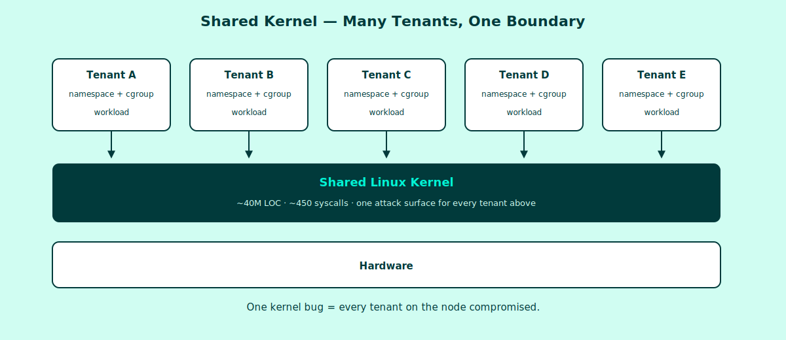
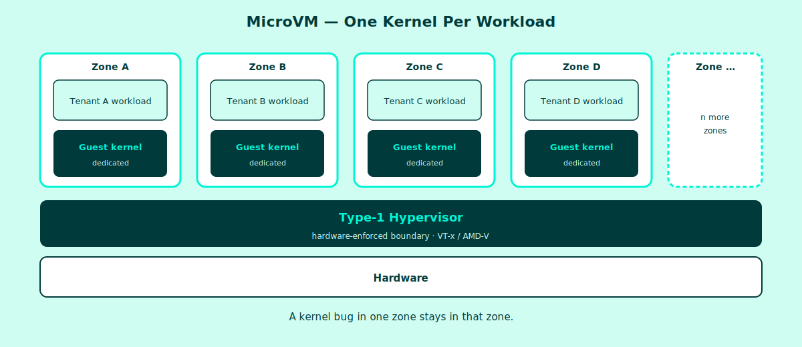
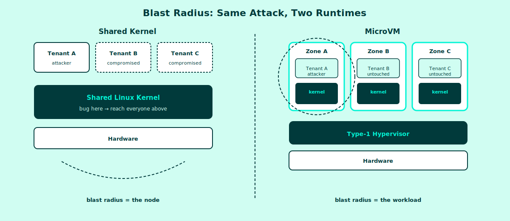

<!-- _class: title -->
<!-- _footer: '' -->

# Beyond Containers

## Why MicroVMs Are Essential for Multi-Tenant Workloads

Lewis Denham-Parry | [Edera.dev](https://edera.dev)
[Cloud Native and Kubernetes Edinburgh](https://www.meetup.com/cloud-native-kubernetes-edinburgh/events/313744012/) | April 14th, 2026

<!--
Speaker Notes:

- Welcome the room

- Lewis from Edera
- KCD UK Organiser, back in Edinburgh this year

- If you don't know your container runtime, you're
  almost certainly running a shared kernel

- Today we're going to learn about the consequences
  and for you to decide if it matters to you
- both at home and at work

- Two live demos that you can try yourself
- Questions at the end to keep pacing tight

---

- Format: 25 minutes + 5 minutes Q&A
- Two live demos: encourage questions at the end to keep pacing tight
-->

---

<!-- _class: dark -->

# Quick Show of Hands

1. Who can name the container runtime they're running in production?
2. Who runs **multi-tenant** workloads on Kubernetes?
3. Who is confident those tenants are actually isolated?

> If your hand dropped between 2 and 3 — this talk is for you.

<!--
Speaker Notes:

- Lets see some hands, or shout out your answer for this one

1. Who can name the container runtime they're running in production?
2. Who runs **multi-tenant** workloads on Kubernetes?
3. Who is confident those tenants are actually isolated?

- By the end I'll show you an attack that exploits that gap,
  and a runtime that closes it.

---

- This is the hook. Pause after each question.
- The gap between question 2 and question 3 is the whole premise.
- Don't rush — let the discomfort sit for a beat.
- Transition: "By the end I'll show you an attack that exploits that gap,
  and a runtime that closes it."
- Time check: ~2 minutes in. Move on.
-->

---

<!-- _class: content -->

# What Is Container Isolation, Really?

A container is **not** a security boundary by default — it's a
*convention* built from two Linux primitives:

- **Namespaces** — isolate *what a process sees* (pid, net, mnt, user, ipc, uts)
- **cgroups** — isolate *what a process consumes* (cpu, memory, io)

Both run against **one shared kernel**.

> "Container" is a UX abstraction. The kernel doesn't know the word.

<!--
Speaker Notes:

- Containers are not a security boundary

- Namespaces
- cgroups

- Another key takeaway
- Containers are not a kernel concept
- Like your end users don't know that you're using Kubernetes to host your service
- This is abstracted away

---

- Important to land this early: "container" is not a kernel concept
- Namespaces give each container its own view of the system
- cgroups limit resource consumption — they are NOT security boundaries
- This is a feature, not a bug: it's what makes containers fast and dense
- The problem is only apparent when tenants don't trust each other
- Spend ~90 seconds on this slide — it's the conceptual foundation
-->

---

<!-- _class: two-columns -->

# Namespaces ≠ Isolation

## What they *do*

- Give each container its own view
- PID 1 inside, isolated hostname
- Private mount and network stacks
- Cheap, fast, no hypervisor

## What they *don't*

- Isolate the **kernel itself**
- Prevent kernel exploits
- Defend against syscall abuse
- Contain side-channel leaks

<!--

- Talk through the positives

- The kernel is shared across every container on a node

- A kernel vulnerability is a multi-tenant vulnerability

- Historical examples: Dirty COW, Dirty Pipe

- One exploit = access to every container on the node

- This isn't theoretical — these are all real, recent CVEs
  and we'll look at some later

- Even if YOUR code is fine, the kernel under you might not be

---

Speaker Notes:

- The kernel is shared across every container on a node
- A kernel vulnerability is a multi-tenant vulnerability
- Historical examples: Dirty COW, Dirty Pipe, runC CVE-2024-21626
- One exploit = access to every container on the node
- This isn't theoretical — these are all real, recent CVEs
- Mention: even if YOUR code is fine, the kernel under you might not be
-->

---

<!-- _class: content -->

# cgroups Are Accounting, Not Policing

cgroups limit resources. They don't prevent abuse of the kernel.

- A tenant can still make syscalls against the shared kernel
- A tenant can still trigger kernel bugs
- A tenant can still affect scheduling and cache behaviour (noisy neighbour)

**Multi-tenancy via namespaces + cgroups is multi-tenancy by politeness.**

<!--

- Talk through points

---

Speaker Notes:
- cgroups answer "how much?" not "is this allowed?"
- Noisy neighbour is the benign case
- Kernel exploit is the malicious case
- Both share a root cause: one kernel
- Lead into: "So what happens when a tenant stops being polite?"
-->

---

<!-- _class: content -->

# The Shape of the Problem

<!--
Speaker Notes:

- Tenants are containers here

- Shared kernel between our applications and hardware

- Hardware is the one to watch out for

- Explain how I see the diagram from application down to hardware up

---

- Hold this image up while making the point
- Every container arrow lands on the same kernel block
- That block is the only thing between tenants and the hardware
- One CVE in that block = every tenant above is exposed
-->

---

<!-- _class: content -->

# This Isn't Theoretical — Recent CVEs

| CVE | Year | Component | Impact |
|---|---|---|---|
| **CVE-2024-21626** | 2024 | runc (Leaky Vessels) | Host filesystem access via leaked fd |
| **CVE-2024-0132** | 2024 | NVIDIA container toolkit | TOCTOU → container escape |
| **CVE-2025-23266** | 2025 | NVIDIA toolkit (NVIDIAScape) | CVSS 9.0 — full escape |
| **CVE-2025-31133** | 2025 | runc | Masked-path race condition |
| **CVE-2025-52565** | 2025 | runc | `/dev/console` mount escape |
| **CVE-2025-38617** | 2025 | Linux kernel | Packet socket use-after-free |
| **CVE-2026-5747** | 2026 | Firecracker virtio-pci | Guest root → host VMM OOB write (potential RCE) |

> One kernel. ~40M lines of C. ~450 syscalls. One bug reaches every tenant.

<!--
Speaker Notes:

- Just mention the CVEs

- [CVE-2026-5747 — VMM layer widens the point]
- Now bring in the newest row on the table. CVE-2026-5747 was disclosed
  on 7 April 2026 — and it's not a kernel bug, not a runtime bug, not a
  GPU toolkit bug. It's in Firecracker's virtio-pci transport: the device
  model that sits between a guest VM and the host.
- What happens: a guest with root can craft a malicious PCI config write
  that triggers an out-of-bounds write in the VMM process on the host.
  That VMM process runs in host userspace with access to guest memory —
  so an OOB write there is one step from host-level code execution.
- Why this matters for the talk: we've just shown the audience kernel
  escapes, runtime escapes, and GPU toolkit escapes. This CVE shows the
  same class of shared-resource bug in the VMM layer — the very layer
  that microVM sandboxes add to improve isolation. Even the "fix" has
  attack surface.
- The architectural lesson to land: the argument is not "microVMs have
  no bugs." It's about where bugs land. A VMM bug in Firecracker affects
  the host-userspace process for one workload. A kernel bug affects every
  tenant on the node. Blast radius is the difference.
- Disclosure context: reported by Anthropic via AWS's Vulnerability
  Disclosure Program (verify Anthropic attribution appears in
  GHSA-776c-mpj7-jm3r before delivery). Fix shipped in Firecracker
  1.14.4 / 1.15.1 for anyone running --enable-pci.

[Cadence over memorisation — land the pattern]
- Don't read CVE numbers off the slide. Gesture at the table and make
  the point about the pattern: "Look at the dates. 2024, 2024, 2025,
  2025, 2025, 2025, 2026. Roughly every quarter, another shared-resource
  escape. Different component each time — runtime, kernel, GPU toolkit,
  VMM — but the same class of bug."
- The message to land clearly: this is not a one-off. This is the new
  normal. The shared-resource stack (kernel, runtime, device model, GPU
  passthrough) keeps producing escapes because it's large, complex, and
  shared. The question is not "will there be another CVE?" — it's "when,
  and what's in the blast radius when it hits?"
- This sets up the second half of the talk: microVMs don't eliminate
  bugs, they shrink the blast radius. The audience should leave this
  slide thinking "okay, so what do we do about this?" — and the answer
  is the next section.

- Source: Beganović, "Your Container Is Not a Sandbox" (March 2026);
  CVE-2026-5747 via GHSA-776c-mpj7-jm3r / AWS-2026-015
- Time check: ~7 minutes in

---

- These are all from the last 24 months — pick one or two to narrate briefly
- CVE-2024-21626 (Leaky Vessels) is the canonical recent example — runc
  leaked a file descriptor pointing at the host /proc; attacker writes to
  /proc/self/fd/N/... and gets host filesystem write
- The NVIDIA toolkit CVEs are the new multi-tenant GPU problem — relevant
  for the AI/ML crowd in the room
- CVE-2025-38617 is the "scariest" kernel example — kernel-level UAF, no
  toolkit bug needed

[CVE-2026-5747 — VMM layer widens the point]
- Now bring in the newest row on the table. CVE-2026-5747 was disclosed
  on 7 April 2026 — and it's not a kernel bug, not a runtime bug, not a
  GPU toolkit bug. It's in Firecracker's virtio-pci transport: the device
  model that sits between a guest VM and the host.
- What happens: a guest with root can craft a malicious PCI config write
  that triggers an out-of-bounds write in the VMM process on the host.
  That VMM process runs in host userspace with access to guest memory —
  so an OOB write there is one step from host-level code execution.
- Why this matters for the talk: we've just shown the audience kernel
  escapes, runtime escapes, and GPU toolkit escapes. This CVE shows the
  same class of shared-resource bug in the VMM layer — the very layer
  that microVM sandboxes add to improve isolation. Even the "fix" has
  attack surface.
- The architectural lesson to land: the argument is not "microVMs have
  no bugs." It's about where bugs land. A VMM bug in Firecracker affects
  the host-userspace process for one workload. A kernel bug affects every
  tenant on the node. Blast radius is the difference.
- Disclosure context: reported by Anthropic via AWS's Vulnerability
  Disclosure Program (verify Anthropic attribution appears in
  GHSA-776c-mpj7-jm3r before delivery). Fix shipped in Firecracker
  1.14.4 / 1.15.1 for anyone running --enable-pci.

[Cadence over memorisation — land the pattern]
- Don't read CVE numbers off the slide. Gesture at the table and make
  the point about the pattern: "Look at the dates. 2024, 2024, 2025,
  2025, 2025, 2025, 2026. Roughly every quarter, another shared-resource
  escape. Different component each time — runtime, kernel, GPU toolkit,
  VMM — but the same class of bug."
- The message to land clearly: this is not a one-off. This is the new
  normal. The shared-resource stack (kernel, runtime, device model, GPU
  passthrough) keeps producing escapes because it's large, complex, and
  shared. The question is not "will there be another CVE?" — it's "when,
  and what's in the blast radius when it hits?"
- This sets up the second half of the talk: microVMs don't eliminate
  bugs, they shrink the blast radius. The audience should leave this
  slide thinking "okay, so what do we do about this?" — and the answer
  is the next section.

- Source: Beganović, "Your Container Is Not a Sandbox" (March 2026);
  CVE-2026-5747 via GHSA-776c-mpj7-jm3r / AWS-2026-015
- Time check: ~7 minutes in
-->

---

<!-- _class: dark -->

# Live Demo: Breaking Container Isolation

**Setup:**

- Multi-tenant Kubernetes cluster
- Default runtime (containerd + runc)
- Two tenants, same node

**Attack:** CVE-2024-21626 (Leaky Vessels) — leaked fd → host filesystem

**Goal:** From Tenant A, read a secret owned by Tenant B.

<!--

Prep it

---

Speaker Notes:
- Screenshot / asciinema recording as backup — always
- Narrate what you're doing, not just what's on screen
- Keep total demo under 4 minutes
- Steps:
  1. Show two tenant namespaces, two workloads, same node
  2. Exec into Tenant A
  3. Exploit leaked fd: cd /proc/self/fd/<N> → walk host filesystem
  4. Read Tenant B's secret from the host view
- Why Leaky Vessels: it's real, well-documented, patchable but widely
  unpatched in long-lived clusters — still works in practice on many
  managed K8s distributions that haven't rolled runc
- If the specific CVE doesn't fit your demo env, any of:
  - privileged pod + hostPath escape (simple, works everywhere)
  - NVIDIAScape (if you have GPU nodes)
  - am-i-isolated signal-only demo (safer fallback)
- If live demo fails: switch to pre-recorded without apologising
- Time check: ~14 minutes in. Move on.
-->

---

<!-- _class: content -->

# What Just Happened

1. Tenant A made syscalls against the **shared kernel**
2. A kernel-level weakness exposed host-level resources
3. Tenant B's isolation evaporated — because it was never really there

**This is not a misconfiguration. This is the architecture working as designed.**

<!--
Speaker Notes:
- Reinforce the point: we didn't exploit a bug in Kubernetes
- We exploited the assumption baked into shared-kernel containers
- This is why the runtime matters
- Transition: "So what does a runtime with a real boundary look like?"
-->

---

<!-- _class: dark -->

<!--
Speaker Notes:
- Pause here — let the gif play and the room breathe
- This is a natural break between "the problem" and "the solution"
- The Inception reference lands the idea: we're going deeper — containers
  inside VMs inside hardware isolation
- No need to narrate — the visual does the work
- Transition after a beat: "So let's go deeper. What does a runtime
  with a real boundary look like?"
-->

---

<!-- _class: content -->

# The MicroVM Idea

Give **each workload its own kernel**, enforced by **hardware**.

- Hypervisor sits between tenant and physical hardware (Type-1)
- Guest kernel is minimal, purpose-built for one workload
- Boundary is enforced by CPU virtualization extensions (VT-x / AMD-V)
- OCI-compatible — looks like a container to Kubernetes

> The blast radius shrinks from *the node* to *the workload*.

<!--
Speaker Notes:
- Key insight: we're not replacing containers — we're hardening them
- The app doesn't know it's in a VM
- Kubernetes doesn't know either — CRI compatibility
- The hypervisor is the new boundary, and it's far narrower than the Linux kernel
- Type-1 vs Type-2: Type-1 runs on bare metal; smaller attack surface
-->

---

<!-- _class: content -->

# The Shape of the Solution

<!--
Speaker Notes:
- Mirror image of the "Shape of the Problem" diagram
- Each zone has its own kernel — call out the vertical stack per zone
- Hypervisor is the only shared block, and it's tiny compared to Linux
-->

---

<!-- _class: two-columns -->

# Shared Kernel vs MicroVM

## Shared Kernel

- One Linux kernel, many tenants
- Boundary: namespaces
- Exploit one → reach all
- Fastest startup, highest density

## MicroVM

- Kernel per tenant
- Boundary: hypervisor (hardware)
- Exploit one → reach one
- Fast enough, density sufficient

<!--
Speaker Notes:
- Use this slide as a visual anchor while explaining
- Emphasise: the blast radius difference is the whole point
- Performance gap has narrowed dramatically in the last 2 years
- Paravirtualization (Edera) closes most of what remains
-->

---

<!-- _class: content -->

# The MicroVM Landscape

| Tool | Sweet Spot | Notes |
|---|---|---|
| **Firecracker** | Serverless / FaaS | AWS Lambda; fast cold start |
| **Cloud Hypervisor** | General VMs | Rust, modern device model |
| **Kata Containers** | Drop-in OCI | Uses Firecracker or CH under the hood |
| **Edera** | Multi-tenant K8s + GPU | Paravirtualized, near-native perf; commercial (uses OSS components) |

Firecracker, Cloud Hypervisor, and Kata are open source; Edera is a commercial product built on open-source components. All four give you a per-workload kernel.

<!--
Speaker Notes:
- Don't oversell any single tool — the point is "this is a real ecosystem"
- Kata is the easiest on-ramp for most teams (CRI-compatible, well known)
- Edera is the one I work on — be upfront about that
- Be explicit that Edera is commercial, unlike the other three
- Cloud Hypervisor and Firecracker are lower-level building blocks
- Firecracker shipped **CVE-2026-5747** (virtio-pci OOB write, HIGH) on
  2026-04-07 — reported by Anthropic via AWS VDP. Good example of the
  VMM-in-userspace class: a device-model bug lands in a host userspace
  process with privileged guest memory access. If it comes up, the
  remediation is upgrade to Firecracker 1.14.4 / 1.15.1 for anyone
  running `--enable-pci`. The architectural point is where the bug
  *lands*, not whether any given VMM has bugs.
- If someone asks about gVisor in Q&A: different threat model
  (user-space syscall interception, not hardware isolation)
-->

---

<!-- _class: content -->

# Honest Trade-offs

- **Cold start:** milliseconds → 100s of ms (Firecracker ~125ms, Edera ~750ms)
- **Memory overhead:** small but non-zero per workload
- **Nested virtualization:** required in some cloud environments
- **Device passthrough:** GPU story is evolving fast

**What you get in return:** a boundary your threat model can actually rely on.

<!--
Speaker Notes:
- Don't hide the trade-offs — credibility matters
- For most multi-tenant workloads, 100-750ms cold start is acceptable
- High-churn serverless is the edge case (and Firecracker targets it)
- Nested virt: AWS bare metal, GCP nested-enabled instances, on-prem bare metal
- GPU: strong use case, actively developed, flag for Q&A
-->

---

<!-- _class: content -->

# Try This Yourself: Edera On

**Edera On** — open-source tool that runs an Edera-protected Kubernetes cluster on your laptop.

- One repo, one README, one command to get going
- Any OCI workload runs inside a per-workload **zone**
- Same `kubectl` you already know

> **Clone it, follow the README, run it tonight:**
> [github.com/edera-dev/on](https://github.com/edera-dev/on)

<!--
Speaker Notes:
- This is the "take it home" moment
- Edera On is the easiest way to get hands-on with the runtime
- Don't read install commands from the slide — point at the repo
  and let the README stay authoritative
- The point of showing this: the audience can reproduce the next demo
  themselves without signing up for anything
- Also sets up the QR code at the end pointing to the repo
-->

---

<!-- _class: dark -->

# Live Demo: Same Attack, Different Runtime

Same cluster topology. Same workloads. Same attack script.

**Change:** container runtime is now **Edera** (via Edera On).

<!--
Speaker Notes:
- The rhetorical payoff of the talk
- Re-run the *exact* commands from the first demo
- Tenant A tries the Leaky Vessels escape — the leaked fd now points
  into the guest kernel's /proc, not the host's
- The "host filesystem" the attacker walks is the zone's filesystem
- Tenant B lives in its own zone, with its own kernel, untouched
- Narrate the hypervisor boundary holding
- Keep this tight: 3-4 minutes max
- Time check: ~26 minutes in
-->

---

<!-- _class: content -->

# Blast Radius, Side by Side

<!--
Speaker Notes:
- Use this as the visual payoff right after the mitigation demo
- Left side: same attack, reaches every tenant on the node
- Right side: same attack, contained to the attacker's zone
- The architecture is the difference, not the workload
-->

---

<!-- _class: content -->

# What Changed

| | Shared Kernel | MicroVM |
|---|---|---|
| Tenant A escape | ✅ succeeded | ❌ contained |
| Tenant B impact | ❌ compromised | ✅ unaffected |
| Attack code | identical | identical |
| Kubernetes config | identical | identical |

**The attack didn't get better. The boundary did.**

<!--
Speaker Notes:
- This is the landing slide — say the line clearly
- Pause after saying it
- The point: you don't need to rewrite apps or redesign platforms
- You need a runtime that enforces what you already thought you had
-->

---

<!-- _class: content -->

# Takeaways

1. **Know your runtime.** `crictl info` — check it today.
2. **Shared kernel ≠ isolated tenant.** Namespaces are a UX, not a boundary.
3. **MicroVMs are production-ready.** OCI-compatible, drop-in, with open-source and commercial options.

**Monday morning action:** run a container-escape test on your cluster.

> [github.com/edera-dev/am-i-isolated](https://github.com/edera-dev/am-i-isolated)

<!--
Speaker Notes:
- One concrete action per takeaway
- am-i-isolated is an open-source tool that shows the problem visually
- Runs in any cluster, takes a few minutes
- Great conversation starter with security teams
-->

---

<!-- _class: title -->

# Thank You — Questions?

Lewis Denham-Parry
[Edera.dev](https://edera.dev)

### Try it tonight

- [github.com/edera-dev/on](https://github.com/edera-dev/on) — run Edera locally
- [github.com/edera-dev/am-i-isolated](https://github.com/edera-dev/am-i-isolated) — test your cluster
- [edera.dev](https://edera.dev) · [github.com/edera-dev](https://github.com/edera-dev)

  

    
    
Get the slides

  

  

    
    
Try Edera On

  

<!--
Speaker Notes:
- Call out both QRs before taking questions:
  "Left QR is the deck itself — grab it now, read later.
   Right QR is Edera On — clone it tonight and try the runtime."
- Open the floor
- Likely questions to have answers ready for:
  Q: "How does this compare to gVisor?"
  A: Different threat model — gVisor intercepts syscalls in userspace;
     MicroVMs enforce the boundary in hardware via the hypervisor.
     gVisor reduces attack surface; MicroVMs provide a true boundary.

  Q: "What's the performance overhead?"
  A: Varies by tool. Edera <5% on most workloads via paravirtualization;
     Firecracker ~125ms cold start; Kata 150-300ms with modern config.

  Q: "Does this work for GPU workloads?"
  A: Yes — and it's where the multi-tenant story gets really interesting.
     GPU memory isolation between tenants is a real, largely unsolved gap
     in shared-kernel setups.

  Q: "Do I have to rewrite my apps?"
  A: No. OCI-compatible. The app sees a Linux kernel; it doesn't know or
     care that it's a per-workload kernel.

  Q: "Can I run this on EKS / GKE / AKS?"
  A: Yes, with caveats around nested virtualization. Bare metal node
     pools are the cleanest path today.

  Q: "What about the Firecracker virtio-pci CVE from last week?"
  A: CVE-2026-5747. Guest-to-host OOB write in Firecracker's PCI
     transport. Anthropic reported it via AWS's VDP. Fix is Firecracker
     1.14.4 / 1.15.1 — upgrade if you run --enable-pci. The broader
     point is architectural: a VMM in host userspace means a
     device-model bug is a host-userspace bug, which is one mitigation
     step from host RCE. A Type-1 boundary puts that same class of bug
     in a different, smaller trust domain.
- Available after the talk for deeper discussions
-->
