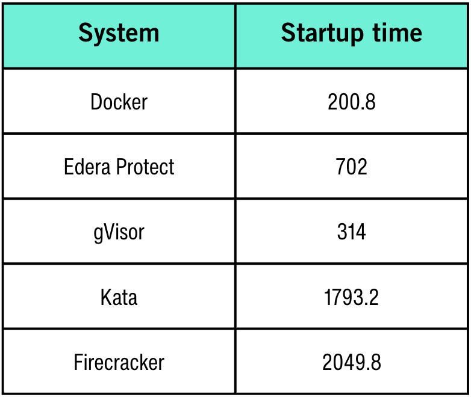
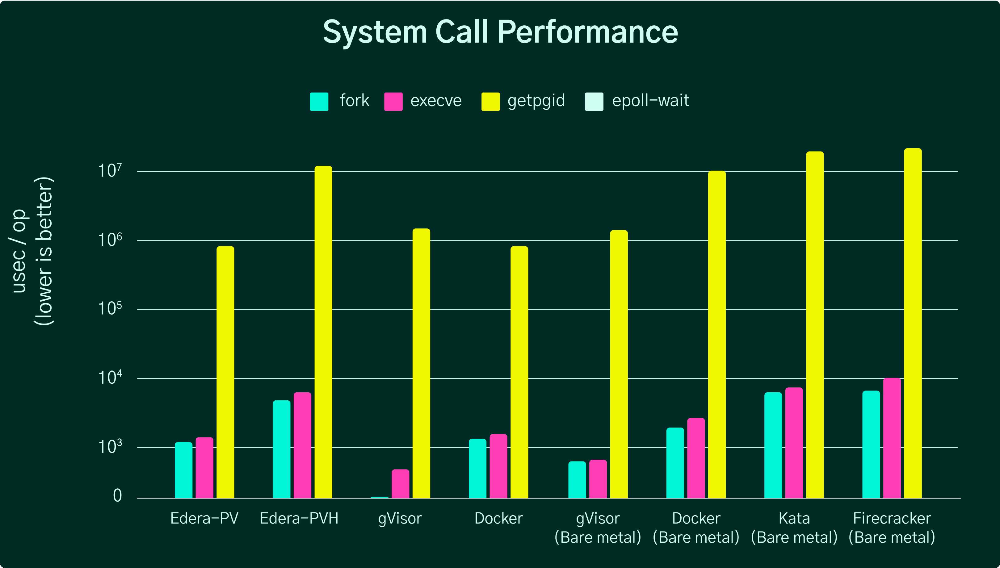

<!-- _class: title -->

# Security in the Cloud Native Landscape

## From Defense in Depth to Preventative Runtime Security

<!--
Speaker Notes:
- Overview of cloud native security evolution
- Target audience: developers and operators
- Duration: 30-40 minutes
- Covers the journey from reactive to preventative security
-->

---

<!-- _class: content -->

# Defense in Depth: The Swiss Cheese Model

**Key Principle:** No single security layer is perfect

- Each layer has vulnerabilities (holes in the cheese)
- Multiple layers prevent complete breaches
- When holes align, attacks can succeed

> Security is not a single solution—it's a layered approach

**Layers in Cloud Native:**
- Network security (firewalls, segmentation)
- Image scanning (CVE detection)
- Observability (monitoring, logging)
- Runtime security (sandboxing, isolation)

<!--
Speaker Notes:
- Introduce Swiss cheese model by James Reason
- Each slice = security control (firewall, scanning, monitoring, etc.)
- Holes = weaknesses or failures in that control
- Multiple layers ensure even if one fails, others catch the threat
- Real-world example: Firewall blocks most, but what gets through needs other defenses
- TODO: Add swiss-cheese-model.png diagram when available
-->

---

<!-- _class: content -->

# Application-Level Risks

## 1. Untrusted Code

- **Third-party dependencies:** npm, pip, Maven packages
- **Supply chain attacks:** Compromised libraries (e.g., event-stream incident)
- **Transitive dependencies:** Code you didn't choose, but rely on

## 2. CVEs in Container Images

- **Base images:** Vulnerabilities in Ubuntu, Alpine, etc.
- **Application layers:** Known security flaws in your stack
- **Lag time:** Delay between CVE disclosure and patching

<!--
Speaker Notes:
- Untrusted code: You're importing code from strangers on the internet
- 80-90% of modern apps are open source dependencies
- Event-stream incident: bitcoin wallet theft via npm package
- CVEs: Common Vulnerabilities and Exposures database
- Even trusted vendors ship vulnerable code
- Question: When was your base image last updated?
-->

---

<!-- _class: two-columns -->

# Real-World CVE Impact

## Finance Sector

- Block containers with HIGH/CRITICAL CVEs
- Strict compliance requirements
- Trade-off: Delayed deployments

## Healthcare Sector

- Similar blocking policies (HIPAA compliance)
- Patient data protection paramount
- Operational continuity vs security

**The Problem:** CVEs discovered in already-deployed containers

<!--
Speaker Notes:
- Finance: PCI-DSS, SOC2 requirements drive strict policies
- Healthcare: HIPAA violations = massive fines
- Both sectors: Can't deploy with known vulnerabilities
- But what happens when a CVE is published for running containers?
- Options: Emergency patching, rollback, accept risk
- This reactive approach is stressful and expensive
-->

---

<!-- _class: content -->

# Image Scanning: The First Line of Defense

**How it Works:**
1. Scan container image before deployment
2. Identify known CVEs in packages and dependencies
3. Block or warn based on severity threshold

**Tools:**
- Trivy, Grype, Snyk, Aqua Security
- Integrated into CI/CD pipelines
- Registry scanning (Docker Hub, GHCR, ECR)

**Limitation:** Scanning is opinionated and not foolproof

<!--
Speaker Notes:
- Image scanning: Static analysis of container layers
- Checks package versions against CVE databases
- Can be integrated at multiple stages: build, pre-deploy, runtime
- Each tool has different CVE databases and detection logic
- False positives: CVEs that don't apply to your use case
- False negatives: Zero-day vulnerabilities not yet in databases
- Key point: Scanning is necessary but insufficient
-->

---

<!-- _class: content -->

# The Post-Deployment Problem

**Scenario:** You deploy a "clean" container today

**Tomorrow:** A new CVE is published for a library in your image

**Challenge:**
- ❌ Scanning doesn't protect running containers
- ❌ You only know about the CVE after deployment
- ❌ Emergency patching disrupts operations

**Industry Response:**
- Finance & Healthcare: Aggressive CVE blocking policies
- Trade-off: Security vs operational continuity
- Delayed deployments waiting for patches

> Scanning tells you **what's wrong**, not **how to prevent it**

<!--
Speaker Notes:
- Time-of-check vs time-of-use problem
- Image is clean at scan time, vulnerable later
- Real example: Log4Shell - discovered in widely-used library
- Every Java app potentially vulnerable overnight
- Frantic patching, deployments halted
- Some orgs: Weeks to fully remediate
- This is the reactive security model
- We need proactive prevention, not just detection
-->

---

<!-- _class: content -->

# Observability: Monitoring the Attack

**Monitoring Spectrum:**

| Approach | Visibility | Overhead | Invasiveness |
|----------|-----------|----------|-------------|
| Logs | Basic | Low | High (code changes) |
| Metrics | Aggregated | Low | Medium |
| Tracing | Detailed | Medium | Medium |
| eBPF | Kernel-level | Very Low | Very Low |

**Modern Approach:** eBPF-based observability
- No application code changes
- Kernel-level visibility
- Minimal performance impact

<!--
Speaker Notes:
- Traditional logging: Application must log security events
- Requires developer discipline, adds code complexity
- Metrics: Prometheus, Datadog - aggregated statistics
- Tracing: Jaeger, Honeycomb - request flows
- eBPF: Extended Berkeley Packet Filter - kernel observability
- eBPF revolution: See everything without modifying apps
- Tools: Cilium, Falco, Pixie
- This is powerful... but still reactive
-->

---

<!-- _class: dark -->

# The Reactive Problem

> **Observability is informative, not preventative**

By the time you **detect** something bad, it has **already happened**

**Examples:**
- ✅ You see the unauthorized API call... **after it executes**
- ✅ You detect the crypto miner... **after it runs for hours**
- ✅ You log the data exfiltration... **after the data is gone**

**The Gap:** Detection vs Prevention

<!--
Speaker Notes:
- This is the fundamental limitation of observability
- Monitoring tells you what happened, not what will happen
- Incident response is always after-the-fact
- Even real-time alerts have lag time
- Attacker advantage: They move faster than your response
- Security teams: Forever chasing indicators of compromise
- What if we could prevent the attack from succeeding in the first place?
- This is where runtime security comes in
-->

---

<!-- _class: content -->

# Container Runtime Security

**Current State:** containerd, CRI-O, Docker Engine

**Key Technologies:**
- **Namespaces:** Process, network, mount isolation
- **Cgroups:** Resource limits (CPU, memory)
- **Capabilities:** Fine-grained privilege control
- **Seccomp:** System call filtering

**Important Context:**
> These were built for **workload isolation**, not **security**

**Original Purpose:** Running multiple workloads on the same machine efficiently

<!--
Speaker Notes:
- Container runtimes: The layer that actually runs your containers
- Namespaces: Each container sees its own isolated view
- Cgroups: Prevent one container from hogging resources
- Docker popularized this in 2013, built on Linux kernel features
- Key point: Goals were multi-tenancy and resource efficiency
- Security was a side benefit, not the primary goal
- Shared kernel architecture = shared attack surface
- Container escapes possible via kernel vulnerabilities
- This is fine for trusted workloads, problematic for untrusted ones
-->

---

<!-- _class: content -->

# The Evolution of Sandboxing

## 1. Kata Containers (2017)

**Approach:** Lightweight VMs per container
- **Pros:** Strong isolation via hypervisor
- **Cons:** Slower startup, higher memory overhead

## 2. gVisor (2018)

**Approach:** User-space kernel (syscall interception)
- **Pros:** Better performance than VMs
- **Cons:** Compatibility issues (~70% syscall support at launch), significant overhead for some syscalls

## 3. Firecracker (2018)

**Approach:** Microvm for serverless workloads
- **Pros:** Fast startup, secure isolation
- **Cons:** Designed for AWS Lambda, limited general use

<!--
Speaker Notes:
- Industry recognized the shared kernel problem
- Kata Containers: Intel + Hyper.sh collaboration
- Each container in its own VM - heavyweight but secure
- Startup times: ~1.8 seconds vs ~200ms for standard containers
- gVisor: Google's approach - intercept syscalls in userspace
- Compatibility: ~70% of syscalls supported at launch (now ~78%), can break some apps
- Firecracker: AWS open-sourced their Lambda runtime
- 125ms startup time, but tightly coupled to AWS use case
- All three: Trade-offs between security, performance, compatibility
- Platform engineers: Still picking 2 of 3 (secure, fast, compatible)
-->

---

<!-- _class: content -->

# Modern Solution: Edera

**Edera's Approach:** Lightweight isolation with minimal overhead

**Key Benefits:**
- ✅ **Security:** VM-level isolation without VM overhead
- ✅ **Performance:** Near-native speed
- ✅ **Compatibility:** Drop-in replacement for container runtimes
- ✅ **Scale:** Works with Kubernetes and orchestrators

**How it Works:**
- Lightweight sandboxing at the kernel level
- Preventative runtime security (not just detection)
- No application code changes required

<!--
Speaker Notes:
- Edera: Built from ground up for secure multi-tenancy
- Addresses the trilemma: Secure AND fast AND compatible
- Not based on VMs or userspace kernels
- Uses modern Linux kernel features for efficient isolation
- Integrates with existing orchestrators
- Platform engineers: Don't have to choose between security and performance
- This is the evolution from reactive to preventative security
-->

---

<!-- _class: content -->

# Performance: Edera vs Alternatives

**Startup Time Comparison:**
- Standard containers (Docker): ~200ms
- Edera: ~700ms
- Kata Containers: ~1.8s

**Result:** Edera is 2.5x faster than Kata while maintaining VM-level isolation

<!--
Speaker Notes:
- Performance chart shows real benchmarks from Edera research paper
- Startup time: Critical for auto-scaling and serverless
- Docker baseline: 200ms, Edera: 700ms (3.5x overhead)
- Kata: 1.8s (2.5x slower than Edera) due to VM boot overhead
- For applications with frequent scaling, this matters
- Edera maintains VM-level security without sacrificing responsiveness
-->

---

<!-- _class: content -->

# System Call Performance

**Observation:** Edera's syscall overhead is minimal compared to gVisor

- **gVisor:** Significant overhead for certain syscalls (especially getpgid) due to userspace kernel
- **Edera:** Near-native performance with security guarantees

<!--
Speaker Notes:
- System calls: How applications interact with kernel
- Every file read, network request, memory allocation
- gVisor intercepts all syscalls in userspace - expensive
- Edera: Optimized path with minimal interposition
- Real-world impact: CPU-intensive apps run faster
- Databases, compilers, video encoding - all benefit
-->

---

<!-- _class: content -->

# Key Takeaways

1. **Defense in Depth:** Multiple security layers are essential
2. **Reactive is Not Enough:** Scanning and observability are necessary but insufficient
3. **Runtime Security Evolution:** From container runtimes to secure sandboxing
4. **Modern Solutions:** Edera combines security, performance, and compatibility

**The Journey:**
- ❌ Single-layer security (insufficient)
- ⚠️ Reactive monitoring (too late)
- ✅ Preventative runtime security (the path forward)

<!--
Speaker Notes:
- Recap the journey we've taken
- Started with defense in depth principle
- Explored application risks, scanning, observability
- Showed why reactive approaches have limitations
- Introduced evolution of runtime security
- Edera as example of modern preventative approach
- Encourage questions and discussion
-->

---

<!-- _class: content -->

# Citations & Sources

**Defense in Depth & Security Models:**
- [Swiss Cheese Model](https://en.wikipedia.org/wiki/Swiss_cheese_model) - James Reason, University of Manchester
- [The Swiss Cheese Cyber Security Defense-in-Depth Model](https://medium.com/@infoseczone/the-swiss-cheese-cyber-security-defense-in-depth-model-6c8f4636548e)

**Supply Chain Security:**
- [npm event-stream incident](https://blog.npmjs.org/post/180565383195/details-about-the-event-stream-incident) - npm official blog
- [Event-Stream Incident Analysis](https://es-incident.github.io/paper.html) - Full academic paper
- [State of Software Supply Chain 2023](https://www.sonatype.com/state-of-the-software-supply-chain/2023/modernizing-open-source-dependency-management) - Sonatype report

**Container Technology History:**
- [Docker History](https://en.wikipedia.org/wiki/Docker_(software)) - Released March 2013
- [Kata Containers Launch](https://www.openstack.org/news/view/365) - December 2017
- [gVisor Release](https://www.infoq.com/news/2018/05/gvisor-container-sandbox/) - May 2018
- [Firecracker Release](https://www.infoq.com/news/2018/12/aws-firecracker/) - December 2018

**eBPF & Observability:**
- [eBPF Applications Landscape](https://ebpf.io/applications/) - Cilium, Falco, Pixie
- [eBPF Tools Overview](https://thenewstack.io/ebpf-tools-an-overview-of-falco-inspektor-gadget-hubble-and-cilium/)

**Performance Benchmarks:**
- [Goldilocks Isolation: High Performance VMs with Edera](https://arxiv.org/html/2501.04580v1) - Technical paper (Jan 2025)
- [Edera Official Site](https://edera.dev/) - Performance comparisons and documentation

<!--
Speaker Notes:
- These citations support all factual claims in the presentation
- Links are provided for audience to verify and learn more
- All dates and statistics have been fact-checked
- Academic and industry sources provide credibility
-->

---

<!-- _class: title -->

# Resources & Further Learning

**Edera Documentation:**
- [edera.dev](https://edera.dev)
- [Getting Started Guide](https://docs.edera.dev)

**Security Resources:**
- OWASP Container Security Guide
- CNCF Security TAG
- Kubernetes Security Best Practices

**Performance Benchmarks:**
- [Edera Performance Comparison](https://edera.dev/benchmarks)

<!--
Speaker Notes:
- Share resources for deeper learning
- Edera docs: Comprehensive guides for getting started
- OWASP: Industry-standard security guidance
- CNCF Security TAG: Cloud native security working group
- Encourage attendees to try Edera in their own environments
- Open for questions
-->
